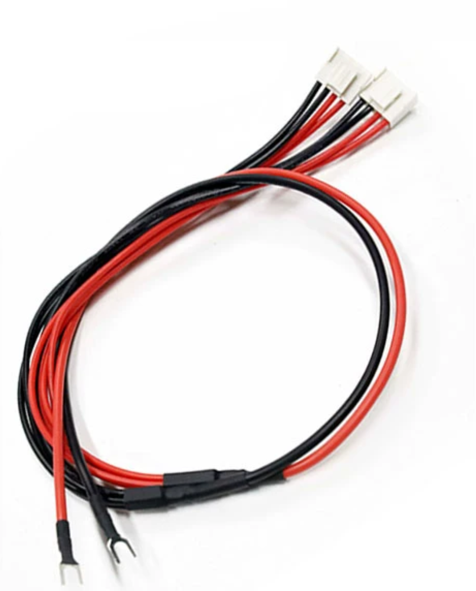

# cable-power-dat

## DC barrel jack

- [[CONN-power-dat]] - [[CONN-DC-barrel-jack-dat]]

## power cable 2 - 1Y2 - 5V output 

- [[CONN-cable-terminal-crimp-dat]]

- [[CONN-dat]] - [[conn-cable-terminal-dat]]

- 名称：一拖二/5V电源线导体材质：铜包铝
- 导体线径：主线2.5平方，分线1.3平方
- 接插端子：主线接U型冷压端子，分线接VH3.96端子
- 尺寸：主线35cm，分线25cm+15cm主线35cm，分线25cm+25cm
- 包装方式：常规10条/捆，500条/箱

## ref 

- [[cable-dat]]

- [[cable-power]]