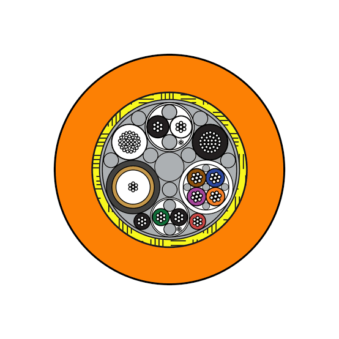

# cable-underwater-dat

## cable in the water 

1. 普通线缆在水下的主要问题
外皮渗水与高压击穿： 陆用 PVC 外皮不耐水压，长时间浸泡后水分子会渗入外皮。尤其是同轴线的编织屏蔽层，一旦渗水会导致阻抗突变、画面严重失真甚至彻底无信号。

物理强度不足： 潜水摄影或水下机器人（ROV）移动时，线缆会被拉扯、摩擦礁石。普通同轴线内部只有单股粗铜丝，频繁弯折极易断芯。

密度与重力问题： 普通同轴线比重较大，入水后会沉入海底，极易缠绕礁石或水草；而如果太轻漂在水面，又会被船桨切断。

2. 水下视频传输的正确方案
   
水下摄影（如 ROV、水下摄像机探头、潜水员水上监视）通常采用专用的水下零浮力线缆（Umbilical Cable）：

水下专用线缆的关键特征：

聚氨酯（PUR）护套： 抗水解、耐海水腐蚀、防刺穿。

芳纶纤维（Kevlar）加强层： 提供几百千克以上的抗拉强度，防止拉断线芯。

零浮力设计： 外皮密度经过特殊调配，线缆在水中呈悬浮状态，不会下沉挂底。

水密接头（SubConn）： 端头配合水密插头使用，防止水压将水从接头处压入线缆内部。

3. DIY 或临时替代建议

如果只是在浅水（2-3米以内）、短时间 DIY 探鱼器或浅水摄像头，可以采用以下低成本折中办法：

选择细径多股软芯线： 不要用硬芯同轴线，改用柔软的多股双绞网线（Cat5e 户外防水款）。

套加厚热缩管或蛇皮网： 关键弯折节点（如摄像头出线口）增加防水灌胶和多层热缩管缓冲。

加挂抗拉绳： 绝对不能靠视频线本身受力，必须平行绑定一根高强度尼龙绳或大力马钓鱼线来承担拉力。

## ref 

