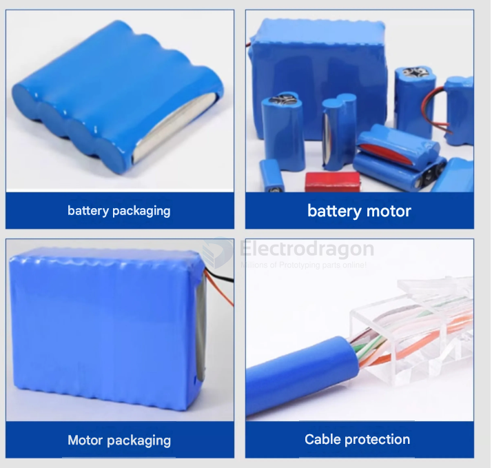
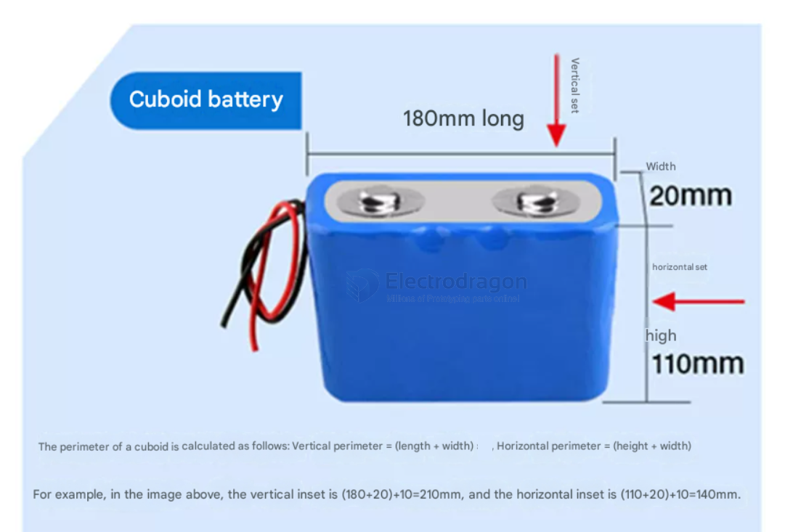

# heat-shrink-tube-dat

common materials == [[PVC-dat]]

## for battery insulation and protection

- 压扁宽度 = 17mm/5米（可套单节7号电池）
- 压扁宽度 = 23mm/5米（可套单节5号电池）
- 压扁宽度 = 29.5mm/5米（可套单节18650电池）
- 压扁宽度 = 36mm/5米（可套单节21700电池）
- 压扁宽度 = 43mm/5米（可套单节26650电池）

产品名称：各种规格的PVC热缩套管 收缩膜 封装套管皮
产品规格：压扁宽度23mm--450MM，（单边壁厚0.08mm----0.25MM）
收缩温度：80℃；
温度范围：-40℃～105℃；
耐温等级：105℃；
收缩率：≥48±5%；
额定电压：300V；
产品包装：100/米；
产品颜色：蓝色
产品定制：可定制（PVC热缩套管颜色，压扁宽度，厚度均可以按要求定制）
 
产品特点：具有优良的环保、绝缘、性能稳定、收缩温度低、收缩快等优点；
 
应用范围：广泛用于铝、电解电容器、电池、电子元器件、灯饰、LED引脚、瓶口的组合包装等，对被包覆物起到美化外观、绝缘、防潮、防腐、防尘的作用。
 
使用贴士：对于短小的热缩管，可使用热吹风来完成收缩，相对直径较大或较长的热缩管，可用热风枪等工具加热使之完全收缩。

## calculation 

- [[battery-pack-dimension-dat]]

- 竖套=（长+宽）
- 横套=（高+宽）

## color 

- transparent 
- black 

## size 

| OD        | flat size | ref             |
| --------- | --------- | --------------- |
| 12 mm     | 20 mm     | [[OPM1153-dat]] |
| ~~14 mm~~ |           |                 |
| 15 mm     |           |                 |
| 16 mm     |           |                 |

## details 

## ref 

- [[heat-shrink-tube]]