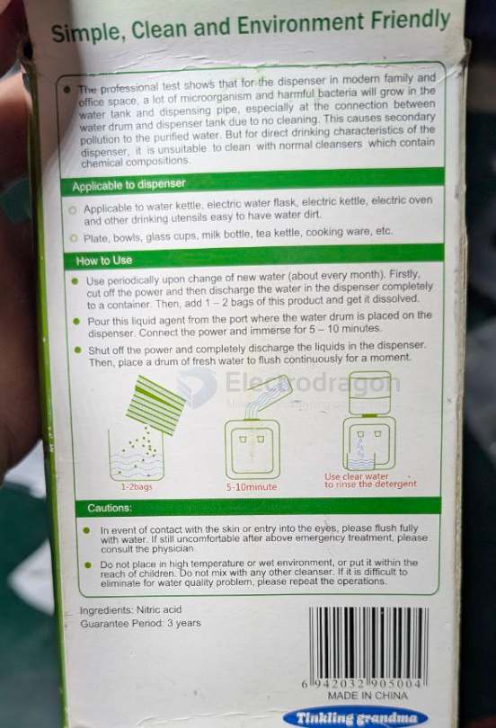

# chemistry-dat

## Nitric Acid (HNO₃)

**Nitric Acid** is a powerful, highly corrosive mineral acid. In its pure form, it is colorless, but older samples often take on a yellow cast due to decomposition into oxides of nitrogen and water.

---

### 🧪 Industrial and Laboratory Applications

Nitric acid is a fundamental chemical building block used across several major industries:

#### 1. Agriculture (Fertilizers)
The largest share of nitric acid production goes toward creating **Ammonium Nitrate** ($NH_4NO_3$). This is a high-nitrogen compound essential for global crop production.

#### 2. Explosives and Munitions
It is a primary reagent in the "nitration" process used to manufacture explosives, including:
* **TNT** (Trinitrotoluene)
* **Nitroglycerin**
* **Gun cotton** (Nitrocellulose)

#### 3. Metallurgy and Etching
* **Pickling:** Used to remove oxidation and impurities from the surface of stainless steel and other alloys.
* **Etching:** Used in printmaking and jewelry to eat into the unprotected parts of a metal surface to create a design.

#### 4. Rocketry
**Red Fuming Nitric Acid (RFNA)** is used as an oxidizer in liquid-fuel rockets, particularly in tactical missiles and older space launch vehicles.

## ref 

