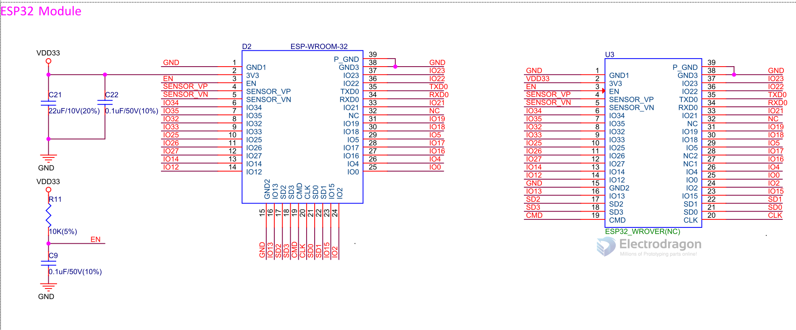

# ESP32-WROOM-DAT

| version             | Flash        | Suffix | SKU             | Antenna  | Note |
| ------------------- | ------------ | ------ | --------------- | -------- | ---- |
| ESP32-WROOM-32      | 4MB = 32Mb   | --     | [[NWI1110-dat]] | PCB      | end  |
| ESP32-WROOM-32D-N4  | 4MB = 32Mb   | N4     | [[NWI1155-dat]] | PCB      |      |
| ESP32-WROOM-32D-N8  | 8MB = 64Mb   | N8     | [[NWI1194-dat]] | PCB      |      |
| ESP32-WROOM-32D-N16 | 16MB = 128Mb | N16    | [[NWI1195-dat]] | PCB      |      |
| ESP32-WROOM-32U-N4  | 4MB = 32Mb   | N4     | [[NWI1157-dat]] | [[Ipex]] |      |
| ESP32-WROOM-32U-N8  | 8MB = 64Mb   | N8     | [[NWI1196-dat]] | [[Ipex]] |      |
| ESP32-WROOM-32U-N16 | 16MB = 128Mb | N16    | [[NWI1197-dat]] | [[Ipex]] |      |

- ESP-WROOM-32D/U are compatible with former ESP-WROOM-32, pin-to-pin compatible.

## Functions 

Module interfaces
- SD card, UART, SPI, SDIO, I2C, LED PWM, Motor PWM,
- I2S, IR, pulse counter, GPIO, capacitive touch sensor, ADC,
- DAC, Two-Wire Automotive Interface (TWAI®), compatible
- with ISO11898-1 (CAN Specification 2.0)
- Integrated crystal 40 MHz crystal
- Integrated SPI flash 4 MB

## SCH

## Pin Definitions 

## Legacy Wiki Pages 

- https://w.electrodragon.com/w/Category:ESP32

- [[ESP32-DAT]]

## Datasheet 

- [ESP32-WROOM-32E DAT EN](https://www.espressif.com/sites/default/files/documentation/esp32-wroom-32e_esp32-wroom-32ue_datasheet_en.pdf)

- [ESP32-WROOM-32D DAT CN](https://www.espressif.com/sites/default/files/documentation/esp32-wroom-32d_esp32-wroom-32u_datasheet_cn.pdf)
- 
6 Peripheral Schematics

### updates 

## ref 

forum - http://esp32.net/

