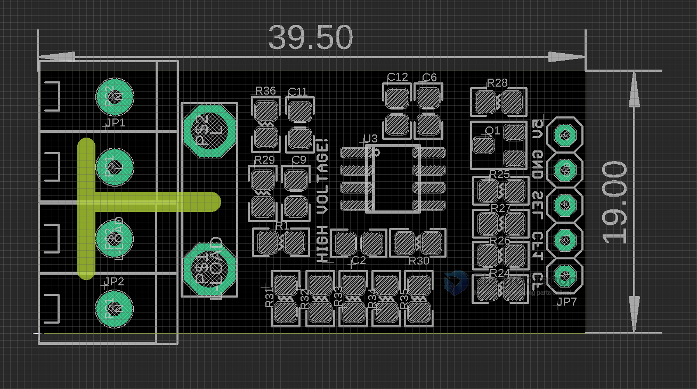
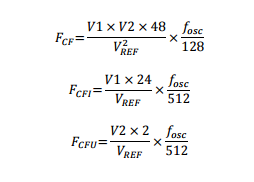

# HLW8012-dat 

## Pin Definitions 

Input Side 

- N
- L
- L-Load
- N

Output Side 

- 5V
- GND
- Sel 
- CF1
- CF

## Calculatoin 

* F_cf  = (V1xV2x48)/(V_ref)^2 x (F_osc/128)
* F_cf1 = (V1x24)/(V_ref)      x (F_osc/512)
* F_cfu = (V2x2)/V_ref         x (F_osc/512)

* Fcf = Power, Fcf1 = current, Fcfu = voltage
* V1: Voltage signal on the current channel pin
* V2: Voltage signal on voltage channel pin
* Fosc: built-in crystal, the typical frequency of about 3.579MHz;
* Vref: built-in reference source, the typical voltage is 2.43V

## Demo 

https://www.youtube.com/watch?v=0aiuwRB8Uic

## DS

- [[File_HLW8012-HLW-REV1.3.pdf]]