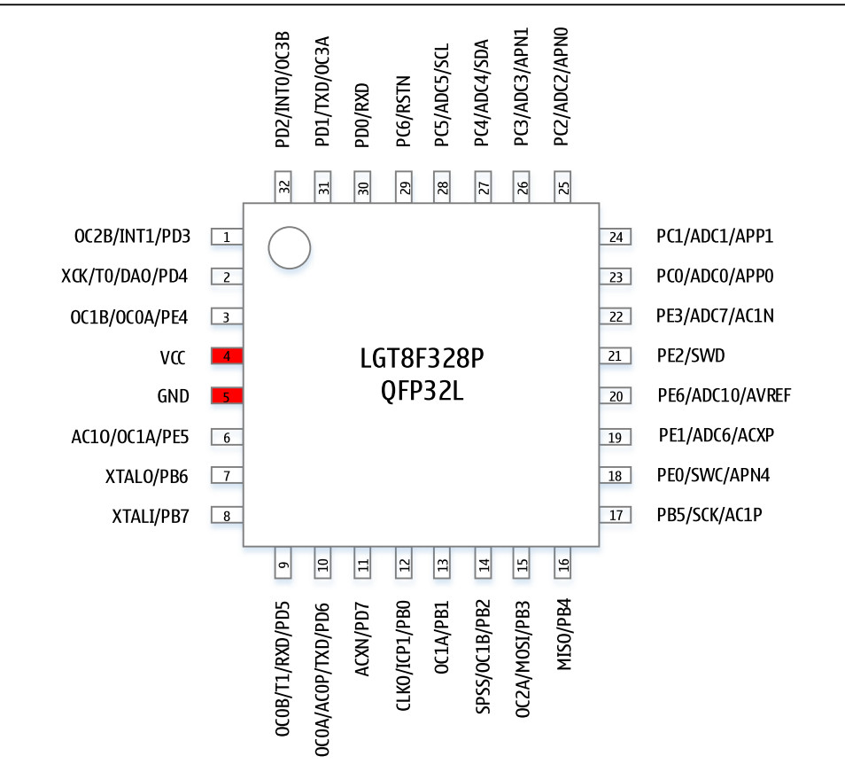

# LGT8F328 DAT

## chip features

- crystal is not soldered, it can work without crystal, unlike [[atmega328]]

## differences 

| pin   | LGT     | ARD |
| ----- | ------- | - |
| pin3  | PE4     | GND | 
| pin6  | PE5     | VCC |
| pin18 | PE0/SWC | AVCC |
| pin21 | PE2/SWD | GND | 

comm 
- pin 4 / pin 5

## bootloader

### nullab 

- Nullab Nano/ Maker Nano 
- https://nulllab.coding.net/p/lgt/d/nulllab_lgt_arduino/git/raw/master/package_nulllab_boards_index_zh.json

### old 
https://github.com/LGTMCU/Larduino_HSP
Installation:
- Unzip master.zip
- Copy the [hardware] directory to Arduino's sketchbook directory (see below to find out where it normally resides)
- Restart Arduino, you will see new board from [Tools]->[Board] menu.

### old bootloader 
- Better not used for experiment, your often daily programming learning or testing, although no problem, but if unexpected error cause the board bricked, you need special programmer to re-programme the bootloader.
- Good to migrate to a low cost board instead of original expensive board.
- Same way to upload sketch as pro mini, notice to choose the board
  - 8F328P - original IC bootloader, please use this one
  - 8F328D - compatible, can also upload code, but don't know if any unknow error.
  - Pro mini - also can upload, but active very wired 

## Programmer 

- arduino UNO can pretend as a chip programmer 
- please contact us if you need to order original programmer

## ref 

- [legacy wiki page](https://www.electrodragon.com/w/Logicgreen) 
- [[LGT8F328]]