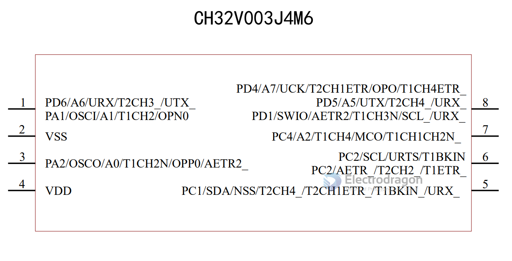

# CH32V003-dat 

## HDK

- PD6 - motor control 
- PC1 - led control 
- PC2 - button input 
- pin 8 = SDIO 

### 标准通讯接口 

- 1 个USART 接口 
- 1 个I2C 接口 
- 1 个SPI 接口

### 烧写

- SWIO 
- 调试模式：串行单线调试接口
- [[WCHLink-dat]] - [[SWIO-dat]] - [[MounRiver-dat]] - [[WCH-PROG-dat]]

### Compile project

- Download sample code: https://www.wch.cn/downloads/CH32V003EVT_ZIP.html
- After decompression, in MounRiver File -> Load -> Project, open GPIO_Toggle.wvproj in the EVT\EXAM\GPIO\GPIO_Toggle directory
- Just press Shift + F7 or compile through the toolbar button. If the compilation is normal, it will be displayed.

## ref 

- [[CH32V003]]