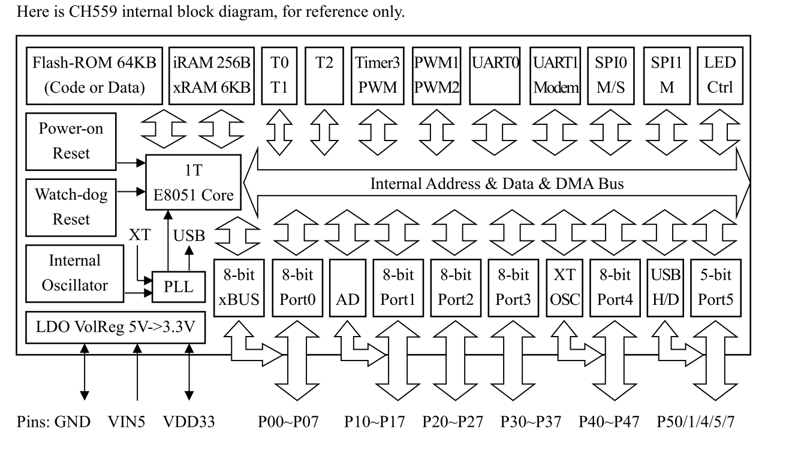

# CH559 DAT

https://kprasadvnsi.github.io/CH559_Doc_English/docs/1-overview/

P12 = PWM3
P23 = PWM1
P25 = PWM2

LED-CTRL:  LED  control  card  interface,  built-in  4-level  FIFO,  supports  DMA  mode,  and 
1/2/4-channel data interface, high speed rate up to Fsys/2. 

P32 P33 P34 P44 = LED 0 LED1 LEDC LED3

P42 = LED5/PWM3_
P43 = LED6/PWM1_