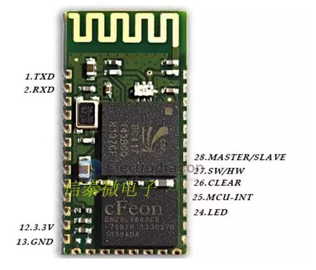

# BC04-B-dat 

## Specifications 

## Certificate 

The module has BQB certification

## Module Specs 

The difference between BC04-B and BC04-A:

BC04-B is a master-slave integrated Bluetooth serial port module. The master-slave command can be switched and the commands are rich and complete.

BC04-A is a slave module product. It can only be used as a slave. It is factory-set. It is easy to use and cheap.

## Product description

1. Adopt CSR mainstream Bluetooth chip and Bluetooth V2.0 protocol standard
2. The working voltage of the serial port module is 3.3V, and the distance is generally 15 meters.
3. The default baud rate is 9600, which can be set by the user.
4. Support software/hardware setting master-slave mode
5. Working status indication, connection and non-connection status signal output, which facilitates MCU to track the status of the module.
6. The size of the core module is: 26.7mmx 13mm x 2.2 mm
7. Working current: Pairing: 2~10mA. Pairing completed but not communicating: 5~6Ma. Communication: 20mA.
8. Sleep current: no sleep, but supports low power consumption mode
9. Used in GPS navigation systems, water, electricity and gas meter reading systems, and industrial on-site procurement and control systems.
10. Can be seamlessly connected with Bluetooth laptops, computers plus Bluetooth adapters, PDAs and other devices

## Product application

This module is mainly used in the field of short-distance data wireless transmission. It can be easily connected to the Bluetooth device of the PC, and can also communicate data between the two modules. It avoids cumbersome cable connections and can directly replace serial cables.
 
- Bluetooth printer 
- Wireless data collection;
- Bluetooth remote control toys 
- Car testing equipment;
- Industrial remote control and telemetry; 
- Bluetooth wireless data transmission;
- Transportation, underground positioning, alarm; 
- POS system, wireless keyboard and mouse;
- Automated data collection system; ※Wireless data transmission; banking system;
- Government street lamp energy-saving equipment 
- TV station’s interactive program voting equipment;
- Wireless LED display system ※Bluetooth joystick, Bluetooth game controller
- Smart home, industrial control ※Building automation, security, computer room equipment wireless monitoring, access control system

## Note 

Product characteristics

1. The power supply voltage is 3.3V, the current is about 2-10mA when not paired, and about 20mA after pairing. It is absolutely forbidden to connect the power supply reversely!

2. The LED pin indicates the Bluetooth connection status. The output pulse indicates that there is no Bluetooth connection. The high output indicates that Bluetooth is connected and the port is open.

3. The interface level is 3.3V, which can be directly connected to various microcontrollers (51, AVR, PIC, ARM, MSP430, etc.). 5V microcontrollers can also be directly connected, without MAX232 and cannot pass through MAX232!

4. Connect the module to the computer, connect the MAX3232 chip and then the serial port of the computer

5. The effective distance in open space is about 15 meters, but the connection quality at this distance is not guaranteed.

6. After pairing, it will be used as a full-duplex serial port. There is no need to know any Bluetooth protocol, but it only supports the communication format of 8 data bits, 1 stop bit, and no parity check. This is also the most commonly used communication format and does not support other formats. .

7. When a Bluetooth connection is not established, it supports setting the baud rate, name, and pairing password through AT commands, and the set parameters are saved after power off. Automatically switches to transparent transmission mode after Bluetooth connection

8. Small size (2.7cm*1.3cm), factory patch production to ensure patch quality.

9. This link is a slave machine. The slave machine can be paired with various computers with Bluetooth functions, Bluetooth hosts, most mobile phones with Bluetooth, PDAs, PSPs and other smart terminals. Slave machines cannot be paired with each other.

## Mode Setup 

Methods and steps for setting the module master-slave mode:

### Hardware setup:

Master mode: 

1. Set PI0(4)—software/hardware master-slave setting port: low (or left floating) to set the master-slave mode for the hardware

2. Set PIO(5)—hardware master-slave setting port: to 3.3V high level

Slave mode: 

1. Set PI0(4) - software/hardware master-slave setting port: low (or left floating) to set the master-slave mode for the hardware

2. Set PIO (5) - hardware master-slave setting port: grounded (or left floating)

 

### Software settings:

Master mode: 

1. Set PI0(4) - software/hardware master-slave setting port: to 3.3V high level

2. Open HyperTerminal or other serial port debugging tools and set the baud rate to 9600, 8 data bits, 1 stop bit, no parity bit, and no flow control.

3. The serial port sends the character "AT+ ROLE1" and successfully returns "+ROLE=1 OK", which is carriage return and line feed.

Slave mode: 

1. Set PI0(4) - software/hardware master-slave setting port: to 3.3V high level

2. Open HyperTerminal or other serial port debugging tools and set the baud rate to 9600, 8 data bits, 1 stop bit, no parity bit, and no flow control.

3. The serial port sends the character "AT+ ROLE0", and successfully returns "+ROLE=0 OK", which is carriage return and line feed.