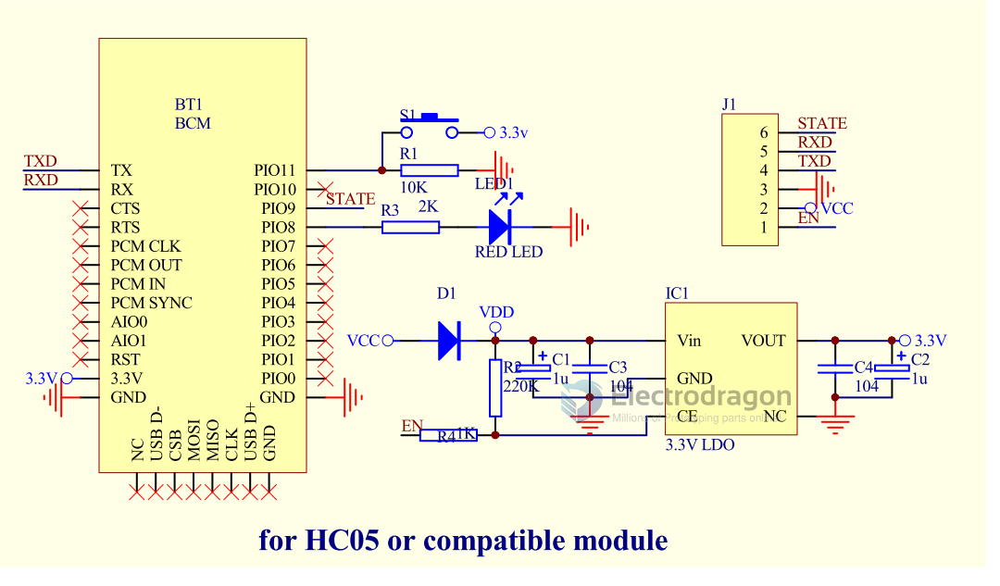

# HC05-dat 

## Enter the AT command.

1: Before powering on the module (or at the same time), set the KEY pin to high level (or connect it to VCC), and then power on the module. At this time, the LED flashes slowly (once every 2 seconds), the module enters the AT state, and the baud rate is fixed at 38400.

2: When the module is powered on, set the KEY pin to low level (or connect it to GND). At this time, the LED flashes quickly (twice in 1S), and then set the KEY pin to high level (or connect it to VCC). The module will also enter the AT command, but the LED will still flash quickly. At this time, the baud rate is the default baud rate of 9600.

## Pin definitions used by the serial port module:

1. PIO8 is connected to LED to indicate the working status of the module. It flashes after the module is powered on. The flashing intervals are different in different statuses.

2. PIO9 connects to the LED to indicate that the module is connected successfully. After the Bluetooth serial port matching connection is successful, the LED stays on.

3. PIO11 module status switching pin, high level-->AT command response working status, low level or floating-->Bluetooth normal working status.

4. The module already has a reset circuit, and the reset is completed when the power is turned on again.

## Steps to set as main module:

1. Set PIO11 high, and then power on the module.

2. After powering on, the module enters the AT command response state.

3. In HyperTerminal or other serial port tools, set the baud rate to 38400, 8 data bits, 1 stop bit, no parity bit, and no flow control.

4. The serial port sends the character "AT+ROLE=1" and returns "OK" successfully, where "is a carriage return and a line feed."

5. Set PIO low, power on again, the module becomes the master module, automatically searches for the slave module, and establishes a connection.

