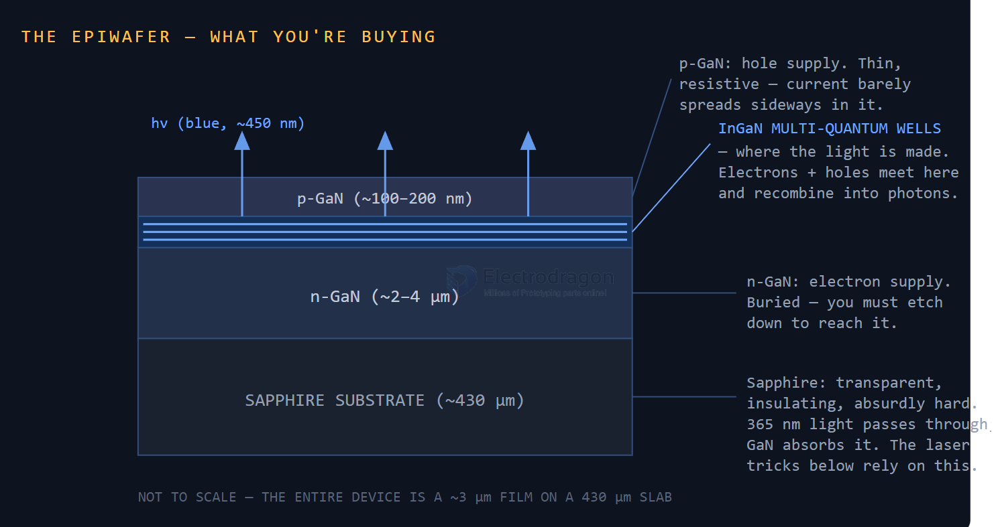

# chip-fab-dat

## LED epiwafer 

An LED epiwafer is a thin single-crystal film of gallium nitride (GaN) grown on a sapphire disc. Three parts matter:

- **n-GaN**: a few microns thick, supplies electrons. It’s buried under everything else, so making contact to it means etching down to it.
- **The multi-quantum wells (MQW)**: a stack of nanometer-thin InGaN layers where electrons and holes meet and recombine into blue photons (~450 nm).
- **p-GaN**: a thin cap that supplies holes. It’s resistive, and current barely spreads sideways in it, which drives several choices below.

For a researcher: standard c-plane LED epi on sapphire, Ga-face up. For everyone else: a mirror-shiny piece of glass-like material that is secretly already 95% of an LED.

## ref 

https://www.semiconductor.diy/guides/making-leds/