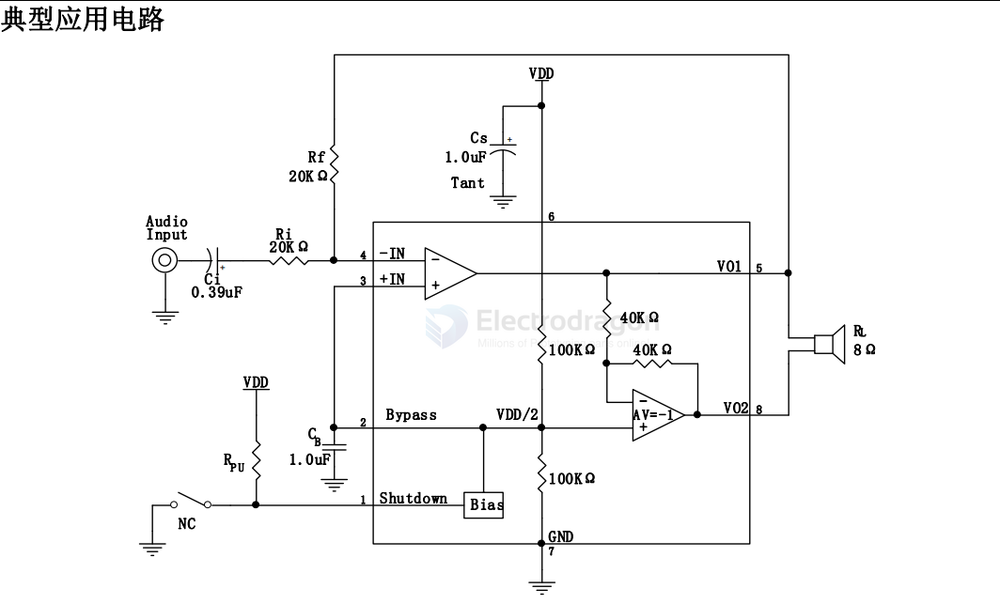

# 8002-dat

- [[amplifier-audio-dat]] - [[8002-dat]] - [[speaker-dat]] - [[bt-audio-dat]]

2W 音频功放 IC

8002A 是适用于便携电子产品的音频功率放大器。5V 电压时，最大驱动功率为 1.5W（8Ω负载）和 2.0W（4Ω负载）。8002A 的应用电路简单，只需要极少数外围器件。

8002A 输出不需要外接耦合电容 或上举电容，采用 SOP8 封装，非常适合低电压、低功耗音频应用方案上使用。

8002A 可以通过控制 进入休眠模式，从而降低功耗。

8002A 通过创新的“开关/切换噪声”抑制技术，杜绝了上电、掉电出现 的噪声。

8002A 工作稳定，增益带宽积高达 2.5MHz，并且单位增益稳定。

通过配置外围电阻可以调整 放大器的电压增益，方便应用。

## ref 

