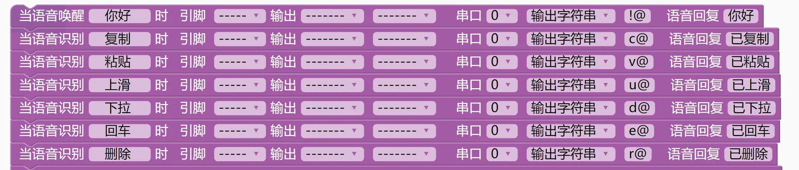
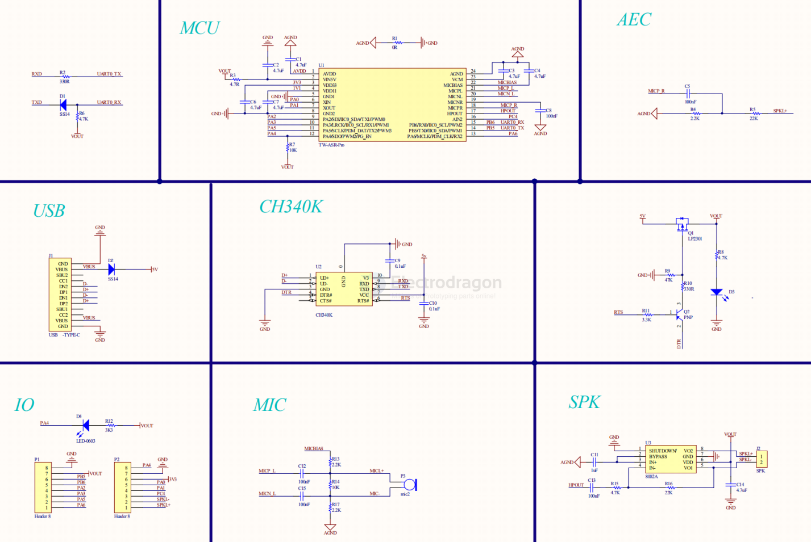
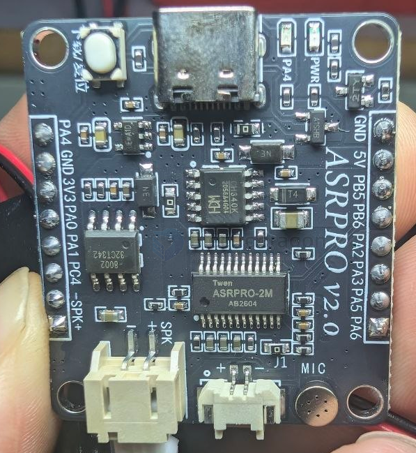
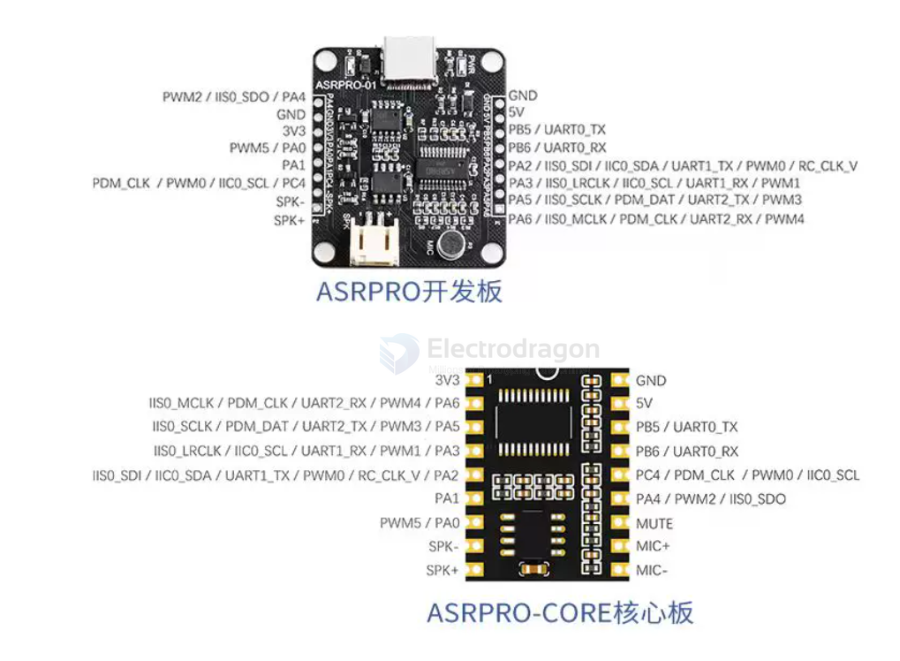

# ASR-PRO-dat

### ASR-PRO 

ASR01

编程平台：

ASR-PRO基于天问Block图形化编程软件编写语音检测程序

CH552G基于Arduino框架编写USB控制程序

- [[ASR-pro-dat]]

## SCH 

- [[8002-dat]] - [[CH340-dat]]

## board 

## specs 

- 识别率	98%以上
- 识别距离	最远可达10米
- 识别响应时间	小于0.1S
- SRAM	640KB
- FLASH	内置２ＭＢ／４ＭＢ两种规格
- 算法	支持 DNN\TDNN\RNN 等神经网络及卷积运算，支持语音识别、声纹识别、语音增强、语音检测、单麦克风降噪增强，单麦克风回声消除，360度全方位拾音等功能
- 时钟	内置高精度 RC 振荡器，无需外部晶体和电容，温漂小于 2% 
- UART接口	3 路 UART 接口，最高可支持 3M 波特率
- IIC接口	1 路 IIC 接口，可以外接 IIC 器件进行扩展 
- PWM接口	6 路 PWM 接口，灯控和电机类应用可直接驱动
- GPIO接口	支持 10 个 GPIO 口，可以作为主控 IC 使用，每个 GPIO 口可配置中断功能，支持上下拉可配置，部分 GPIO 支持宽压 5V 电平信号直接通信，无需外接电平转换。
- 供电范围	供电电压3.6V-5V，供电电流>500mA
- 工作温度	-40℃~85℃
- 存储环境	-40℃~100℃ <5%RH

- [[SDK-twen51-dat]] - [[SDK-dat]]

## ref 

Arduino+Asr_pro语音模块：智能语音交互 - https://blog.csdn.net/m0_63715549/article/details/131297307

ASR-PRO官方资料汇总：https://www.haohaodada.com/new/bbs/forum.php?mod=viewthread&tid=592&page=1&extra=#pid1355

