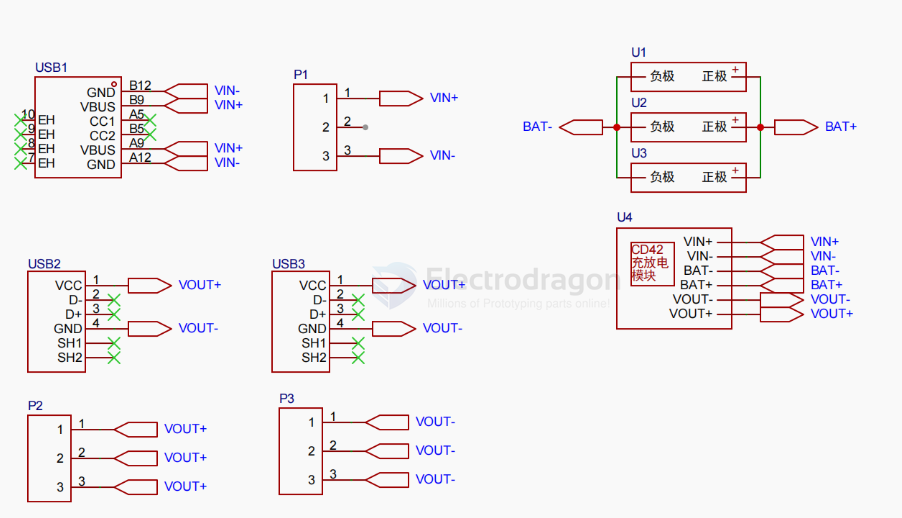
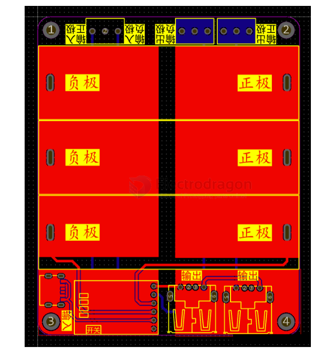
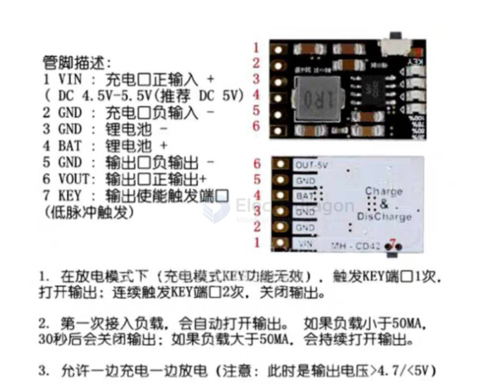

# CD42-dat

- [[battery-charger-dat]] - [[CD42-dat]]

3-parallel 

管脚描述：
- 1  VIN：充电口正输入+（DC4.5V-5.5V（推荐DC5V）
- 2  GND：充电口负输入-
- 3  GND：锂电池-
- 4  BAT：锂电池+
- 5  GND：输出口负输出-
- 6  VOUT：输出口正输出+
- 7  KEY：输出使能触发端口（低脉冲触发）

- 1. 在放电模式下（充电模式KEY功能无效），触发KEY端口1次，打开输出：连续触发KEY端口2次，关闭输出。
- 2. 第一次接入负载，会自动打开输出。如果负载小于50MA，30秒后会关闭输出：如果负载大于50MA，会持续打开输出。
- 3. 允许一边充电一边放电（注意：此时是输出电压>4.7/<5V）

## ref 

