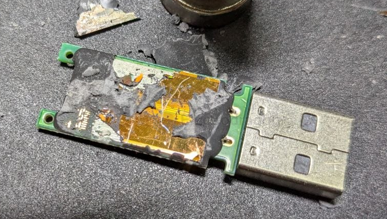

# Glob-Top-dat

The black, circular, flat "covering" you see on a circuit board is professionally known as **COB (Chip on Board)** or **"Glob Top" encapsulation**.

### 1. What is it?
It is not a separate component (like a resistor or capacitor); it is a **direct-die mounting method**. 
* Inside that black glob, there is a bare silicon integrated circuit (die) bonded directly onto the printed circuit board (PCB).
* It is connected to the board via microscopic gold or aluminum wires.
* The black material is an **epoxy resin**. It acts as a protective shield, protecting the fragile silicon die and the tiny bonding wires from moisture, dust, oxidation, and physical impact.

### 2. Why is it used?
You will typically find this in consumer electronics like calculators, toys, digital scales, and remote controls for several reasons:
* **Cost Efficiency:** It eliminates the need for expensive plastic packaging and leads, drastically reducing production costs.
* **Miniaturization:** Since there is no bulky outer plastic housing, the component takes up minimal vertical and horizontal space.
* **IP Protection:** Because the resin is chemically and physically very hard to remove without destroying the delicate wires and silicon, it makes the specific chip logic difficult to reverse-engineer.

### 3. Can it be repaired?
**Generally, no.** * The epoxy resin is designed to bond permanently to the board. 
* Attempting to remove it usually tears the microscopic bond wires or cracks the silicon die.
* Unlike components with pins (like DIP or SMD packages), these "Glob Top" chips are treated as non-serviceable parts. If the chip fails, the standard solution is to replace the entire circuit board.

---

This design represents a classic example of modern, high-volume industrial manufacturing where reliability is maintained through chemical sealing rather than mechanical housing.

## Disassembling a "Glob Top" (COB)

Disassembling a "Glob Top" (COB) component is extremely difficult and almost always results in the permanent destruction of the device. Because the epoxy resin is chemically bonded to the PCB surface and the internal bond wires are finer than human hair, standard repair tools will not work.

### Why Disassembly is Usually Destructive:
1. **Bond Wire Fragility:** The gold wires connecting the silicon die to the PCB traces are microscopic. Even the slightest mechanical pressure from a tool will snap them.
2. **Resin Hardness:** The epoxy is formulated to be rigid and heat-resistant. Trying to chip it away manually will almost certainly crack the underlying silicon chip.
3. **Chemical Resistance:** While certain solvents (like fuming nitric acid or specialized decapsulation chemicals) can dissolve the resin, these are highly toxic, hazardous to handle, and typically unavailable outside of a professional failure analysis laboratory.

### If You Must Attempt It (For Learning/Research Purposes Only):
If you have a broken board and want to see what is underneath out of curiosity, you can attempt these methods, **knowing the chip will not survive**:

* **Mechanical Grinding/Sanding:** Use fine-grit sandpaper or a precision rotary tool (like a Dremel) at a very low speed to carefully sand away the top layer of the black resin. Stop as soon as you see the shiny metallic surface of the silicon die.
* **Thermal Shock:** Some cheaper epoxies can be made brittle by extreme temperature changes (e.g., placing the board in a freezer and then applying quick, localized heat with a hot air rework station). This can sometimes cause the resin to crack or flake off, though it is unpredictable.
* **Heat Gun:** A professional heat gun set to 250°C–300°C can soften some softer resin compounds, allowing you to carefully pick at the edges with a precision needle or dental pick. 

### Warning
* **Health Hazard:** If you use heat to soften the resin, it may release toxic fumes. Always work in a **well-ventilated area** or under a fume hood.
* **Safety:** Use eye protection. Small shards of epoxy or brittle silicon can fly off if the resin cracks unexpectedly.

**Are you trying to recover data or fix a specific functionality, or are you just interested in seeing the silicon architecture?**

## ref 

