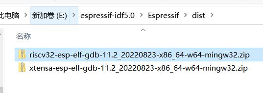
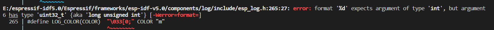
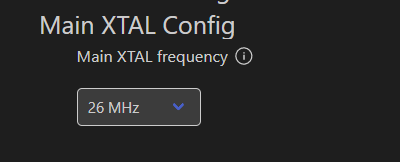

# esp8684 sdk

## common error

- [[esp-idf]]

1.安装ESP IDF失败
在线安装：在线安装esp-idf需要代理，一些文件放置在github
离线安装：离线包下载地址https://dl.espressif.cn/dl/esp-idf/，选择ESP-IDF v5.0 - Offline Installer

安装过程中，需要从github下载两个文件，也可手动放置这两个文件到选择的IDF路径下的dist文件夹中

https://github.com/espressif/bin ... _64-w64-mingw32.zip
https://github.com/espressif/bin ... _64-w64-mingw32.zip

2.提示%d uint32与long unsigned int不匹配，编译失败

这是ESP32C2的RISCV架构的typeint.h与idf框架的不一致导致的。乐鑫后续版本解决，目前可以先屏蔽这个警告

    在main/CMakeLists.txt中添加下面的语句暂时忽略这个警告

    component_compile_options(-Wno-error=format= -Wno-format)

3.不能连接WIFI
修改menuconfig中的晶振频率为26M

