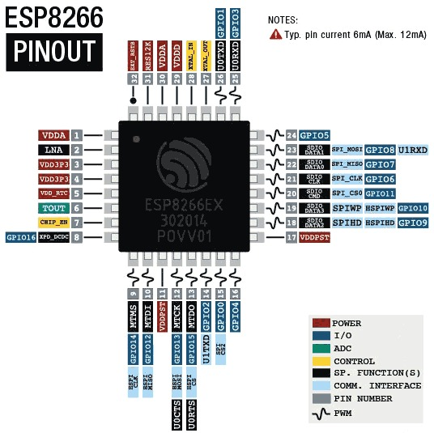

74880

download mode:

    ets Jan 8 2013,rst cause:2, boot mode:(1,7)

normal mode: 

    ets Jan  8 2013,rst cause:2, boot mode:(3,7)

    load 0x40100000, len 28740, room 16
    tail 4
    chksum 0xef
    load 0x33333333, len 858993459, room 4

debug common errors

    ~~晶振 烧？~~

    晶振电容不对 12PF

FLASH

    不焊，可以输出信息

    ets Jan 8 2013,rst cause:2, boot mode:(1,2)

    Flash 焊反， 不会烧

    ets Jan 8 2013,rst cause:1, boot mode:(1,7)

### ESP-07S
https://item.taobao.com/item.htm?spm=a1z10.3-c-s.w4002-24362052676.18.5fea546eVPh2is&id=43603016316