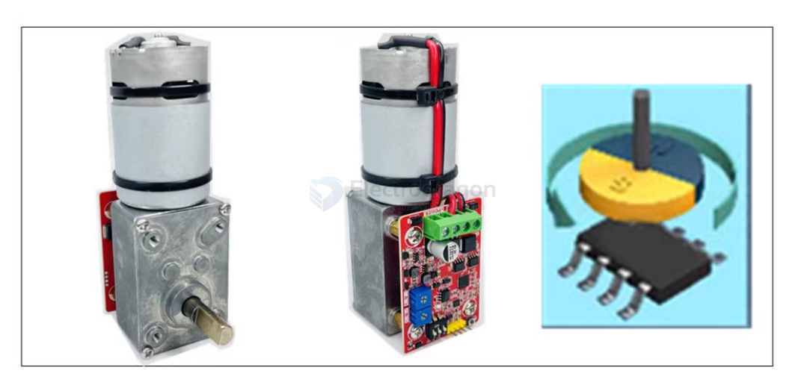

# worm-gear-dat

A worm gear is a type of gear arrangement in which a screw (the worm) meshes with a gear (the worm wheel). The worm resembles a screw and is typically used to reduce speed and increase torque in mechanical systems.

Worm gear systems are known for their ability to provide high reduction ratios in a compact space and for their self-locking capability, meaning the gear cannot easily drive the worm back.

- [[servo-dat]]

