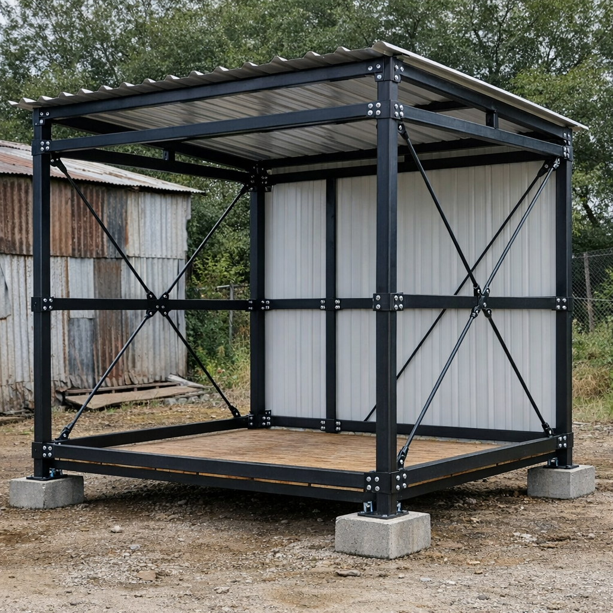

# steel-build-house-one-person-dat.md

五、构件尺寸快速表（照着买）
部位	规格
立柱	40×40×2.0 mm
顶部圈梁	40×40×2.0 mm
水平拉杆	30×30×2.0 mm
斜撑	25×25×1.5 mm
螺栓	M8 / M10（8.8 级）
六、安装顺序（1 人也能装）

1️⃣ 摆好底座
2️⃣ 立 4 根柱（先不锁死）
3️⃣ 装顶部圈梁（形成闭合框）
4️⃣ 装水平拉杆
5️⃣ 装斜撑
6️⃣ 整体校正 → 全部拧紧
7️⃣ 上屋顶

一、先给结论（直接照这个做）

✅ 1 吨级临时简易房是可行的
👉 前提：面积小 + 构造正确 + 有最基本拉结

二、适用前提（重要）

这个方案 只在以下条件下成立：

单层

面积 ≤ 9–10 ㎡（例如 3 × 3 m）

居住 1 人（2 人勉强）

无水箱 / 电池 / 重设备

屋顶轻（铁皮 / 彩钢）

使用 方钢管

⚠️ 超出这些条件 → 1 吨不够

三、推荐结构参数（最小安全配置）
1️⃣ 立柱（4 根）
项目	推荐
材料	方钢管
尺寸	40×40×2.0 mm
高度	≤ 2.5 m
数量	4 根

👉 单根承载目标 ≈ 250 kg
👉 实际能力远大于这个值（有拉结时）

2️⃣ 顶部圈梁（必需）
项目	推荐
尺寸	40×40×2.0 mm
形式	四周闭合一圈
连接	焊接 / 法兰螺栓

👉 没有圈梁 = 结构不成立

3️⃣ 水平拉杆（强烈建议）

高度：1.2～1.5 m

材料：30×30×2.0 mm

每侧至少 1 根

👉 把 2.5 m 的柱变成两段短柱

4️⃣ 斜撑（非常关键）

每个立面至少 1 个 X 或 V

材料：25×25×1.5 mm 即可

👉 这是防“一推就倒”的关键件

四、屋顶（尽量轻）

彩钢板 / 镀锌铁皮

木檩条 或 20×40 方管

不做混凝土、不铺厚板

👉 屋顶控制在 ≤ 200 kg

五、基础（超简化，但别省）
最简方案 1（可拆）

4 块：

混凝土垫块

或钢板 + 垫木

立柱底部焊 法兰板

👉 只要防下沉 + 防滑即可

六、整屋重量预估（参考）
项目	重量
钢结构	250～300 kg
屋顶	150～200 kg
墙体	200～300 kg
人 + 物	200～300 kg
合计	800～1100 kg

👉 正好在 1 吨级

七、常见错误（务必避开）

❌ 只有 4 根柱 + 顶梁
❌ 没斜撑
❌ 立柱过细（≤30 mm）
❌ 高度 > 3 m
❌ 屋顶太重

1 吨结构失败，90% 是侧向失稳

八、一句话总总结

1 吨级临时简易房：

✅ 可以用 40×40×2 mm 方钢管

✅ 必须有 圈梁 + 拉杆 + 斜撑

⚠️ 面积别贪

❌ 不适合长期居住

