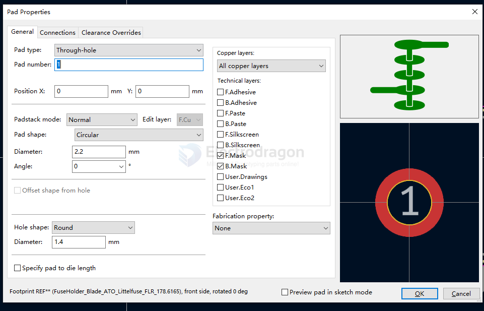

# kicad-footprint-dat.md

- [[kicad-symbol-dat]] - [[kicad-pcb-dat]]

## custom build footprint guide 

## common used global library 

- Connector_pinheader 
- Connector_Wire
    - SolderingWirePad_1x01_SMD_1x2mm
- Connector_USB
    - USB_C_Receptacle_G-Switch_GT-USB-7010ASV
    - USB_A_CNCTech_1001-011-01101_Horizontal == [[USB-A-dat]]
- MountingHole 
    - MountingHole_3.2mm_M3  
- Package_SO
    - SOIC-8_5.3x5.3mm_P1.27mm
    - SOIC-16_10.3x7.5mm_P1.27mm
    - SOP-8_3.9x4.9mm_P1.27mm
    - SOP-8_3.76x4.96mm_P1.27mm

## other collections 

[Kicad_FPC_board_ends](https://github.com/mikeWShef/Kicad_FPC_board_ends)

## QA 

how to import or open kicad .mod file?

`.mod` is KiCad’s **legacy footprint library** format (pre–KiCad 5). 

Modern KiCad uses `.kicad_mod` files inside `.pretty` folders.

### Method 1 — Import with Library Wizard (Legacy Loader)

1. Open **PCB Editor**.
2. Go to **Preferences → Manage Footprint Libraries**.
3. Click **Append with Wizard** (or **Add existing library**).
4. Select your **`.mod`** file.
5. Finish the wizard → the legacy library is added and usable.

### Method 2 — Convert to Modern `.pretty` Library (Recommended)

Use KiCad’s converter to create a modern library:

~~kicad-footprint2pretty old_library.mod new_library.pretty~~

**footprint editor -> import -> select .mod file**

Result: new_library.pretty/ containing individual *.kicad_mod footprints.

Then in PCB Editor: Preferences → Manage Footprint Libraries → Add the new .pretty path.

### Method 3 — Use Older KiCad to Re-save

Open the .mod in KiCad v4 (or compatible).

Export/Save footprints to a .pretty library, then add it in current KiCad.

Tips
Keep original .mod as a backup.

After conversion, verify pad sizes, layers, and 3D model links.

## ref 

- [[kicad-symbol-dat]]