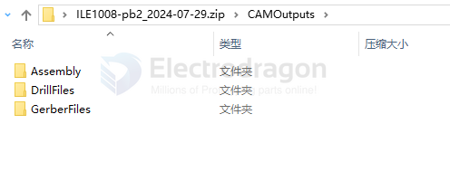

# PCBA-dat

- [[soldering-dat]] - [[desoldering-dat]]
  
- [[spot-welding-dat]] 

- [[solder-paste-dat]]

- [[PCB-dat]]

- [[PNP-machine-dat]] - [[reflow-machine-dat]] 

- [[PCB-cleaner-dat]]

## PCBA 

- include extra assembly, files 
  

## PCBA Design 

- [[PCB-dat]]

- [[penalization-dat]] - [[EDA-dat]]

# PCB-make-dat

- [[mark-point-dat]] - [[export-coordinate-dat]]

## make machine 

[[machine-dat]] - [[pnp-machine-dat]]

## PCB protection service 

- for this module, consider add - Adhesive Solutions on PCBs - [[PCB-Adhesive-dat]]
- or layered plastic case [[layered-case-dat]]
- more simple soltuion - [[PMP1037-dat]]

## ref 

- [[fab-dat]] 

- [[fab]]

