# fab-stencil-dat 

- [[fab-PCBA-dat]]

## common size frameless

- 10 x 10 cm
- 15 x 15 cm
- 20 x 20 cm

other un-common size frameless

- 10 x 15 cm
- 15 x 20 cm

### all size framed 

- 30*40cm（有框）
- 37*47CM（有框）
- 42*52CM（有框）
- 45*55CM（有框）
- 55*65CM（有框）
- 73.6*73.6CM（有框）

25 X 30 CM
30 X 40 CM
37 X 47 CM
42 X 52 CM
45 x 55 CM
40 x 60 CM
40 x 70 CM
40 x 80 CM
58 X 58 CM
55 x 65 CM

| no. | area                | usable   | price   | weight |
| --- | ------------------- | -------- | ------- | ------ |
| 1   | 37 x 47             | 19 x 29  | 71 RMB  | 1.5KG  |
| 2   | 30 x 40             | 14 x 24  | 68 RMB  | 1KG    |
| 3   | 42 x 52             | 24 x 34  | 89 RMB  | 1.8KG  |
| 4   | 45 x 55             | 27 x 37  | 113 RMB | 2KG    |
| 5   | 58.4 x 58.4         | 38 x 38  | 137 RMB | 3.2KG  |
| 6   | 55 x 65             | 34 x 44  | 147 RMB | 3.5KG  |
| 7   | 73.6 x 73.6         | 50 x 50  | 187 RMB | 5KG    |
| 8   | 28 x 38 (frameless) | 19 x 29  | 55 RMB  | 0.8KG  |
| 9   | 40 x 60             | 22 x 40  | 110 RMB | 2.5KG  |
| 10  | 40 x 80             | 22 x 60  | 125 RMB | 3.5KG  |
| 11  | 40 x 100            | 22 x 76  | 141 RMB | 4KG    |
| 12  | 40 x 120            | 22 x 100 | 165 RMB | 6KG    |

## Features 

- thickness 0.1 mm 
- "cutting" precision 0.005 mm
- or 0.01 mm
- "machine" bias 0.05 mm

## stencil printer 

### table printer 

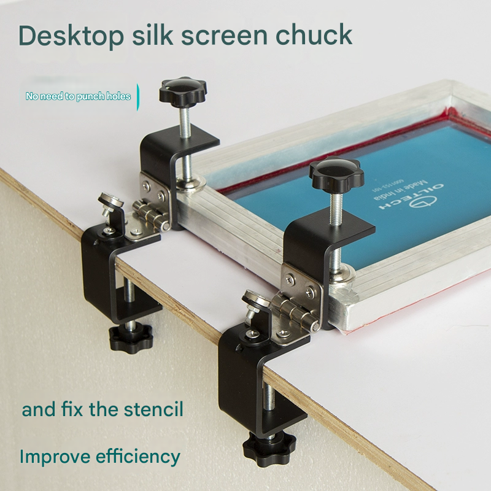

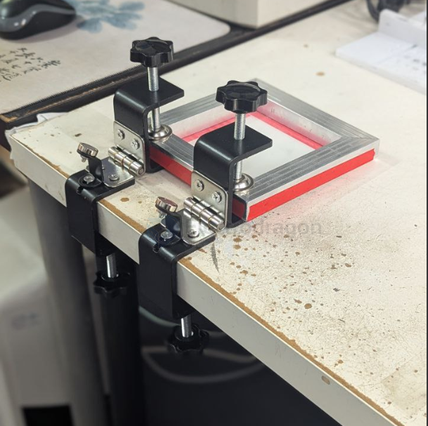

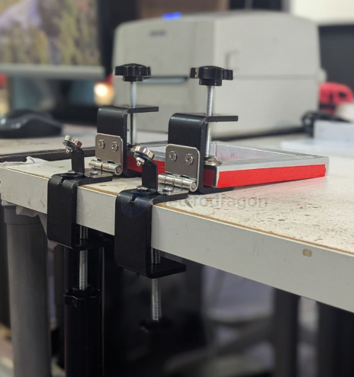

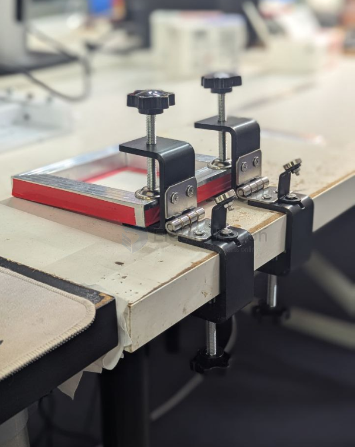

### screwed printer 

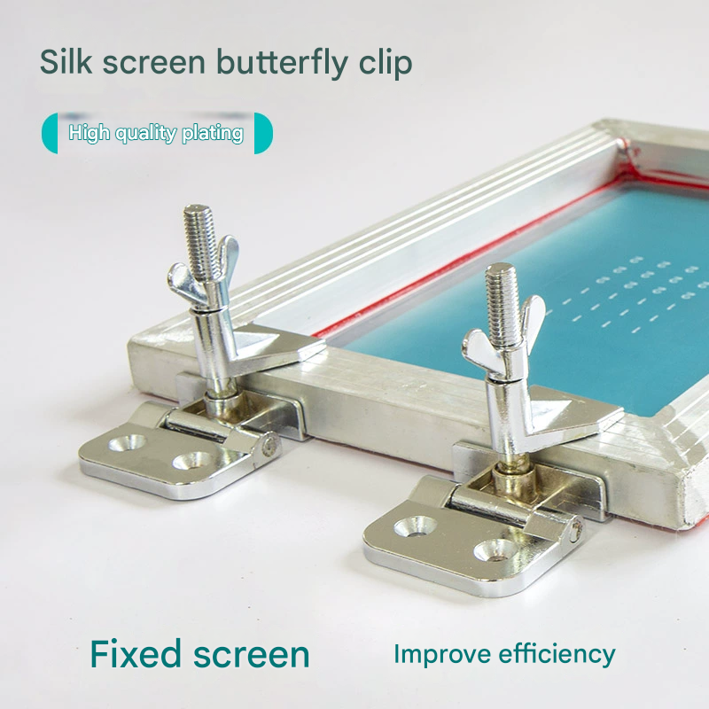

### 3D printed holder 

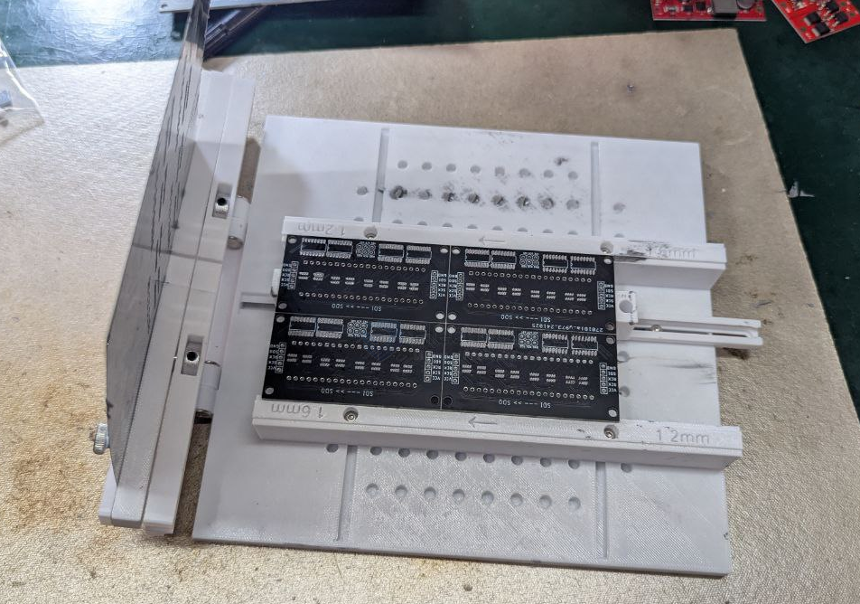

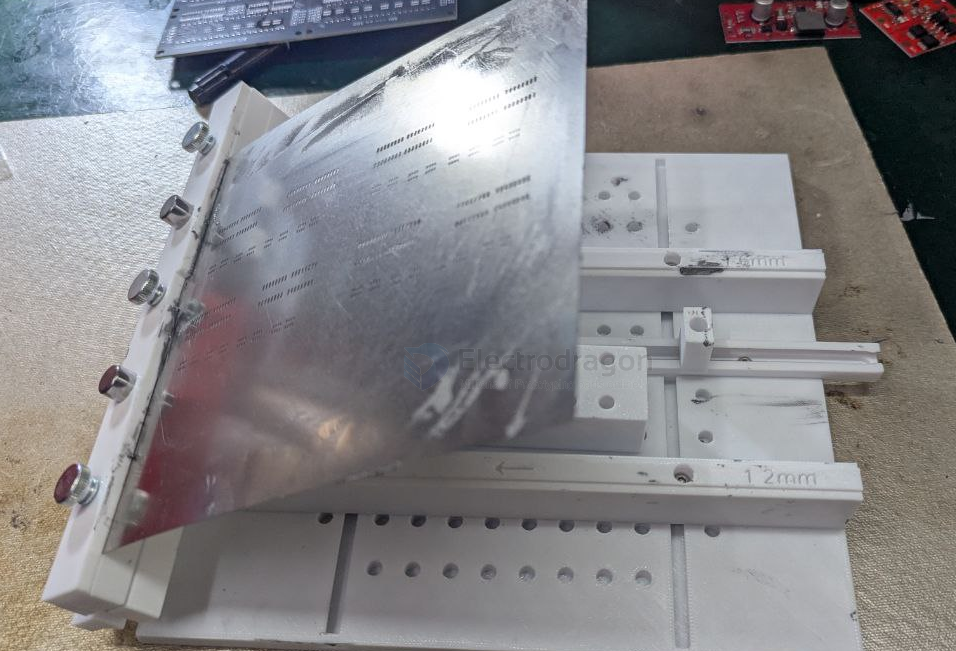

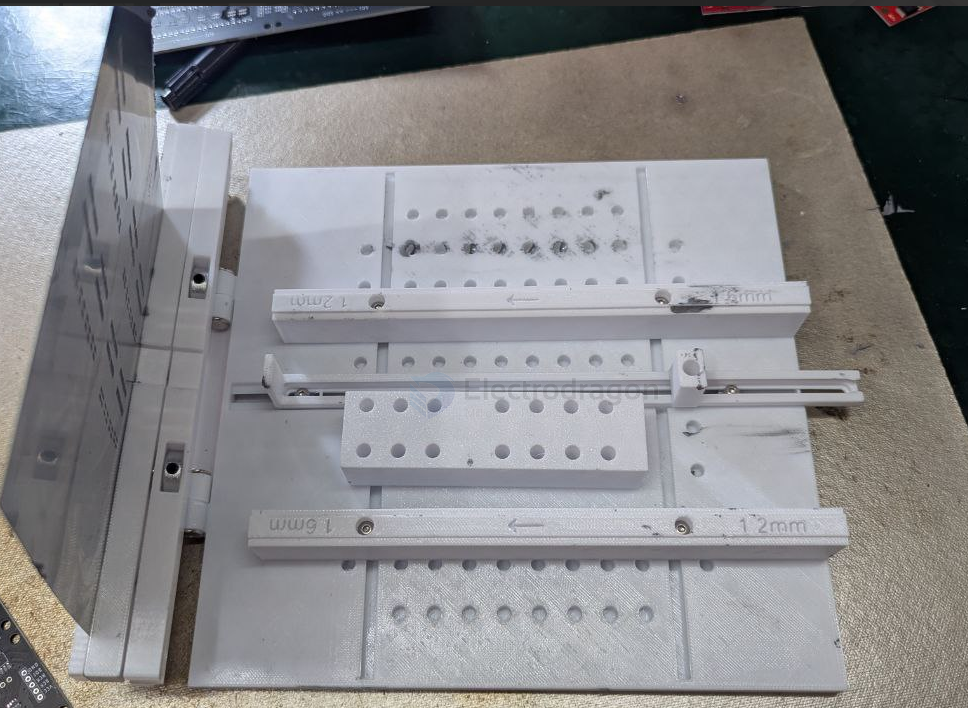

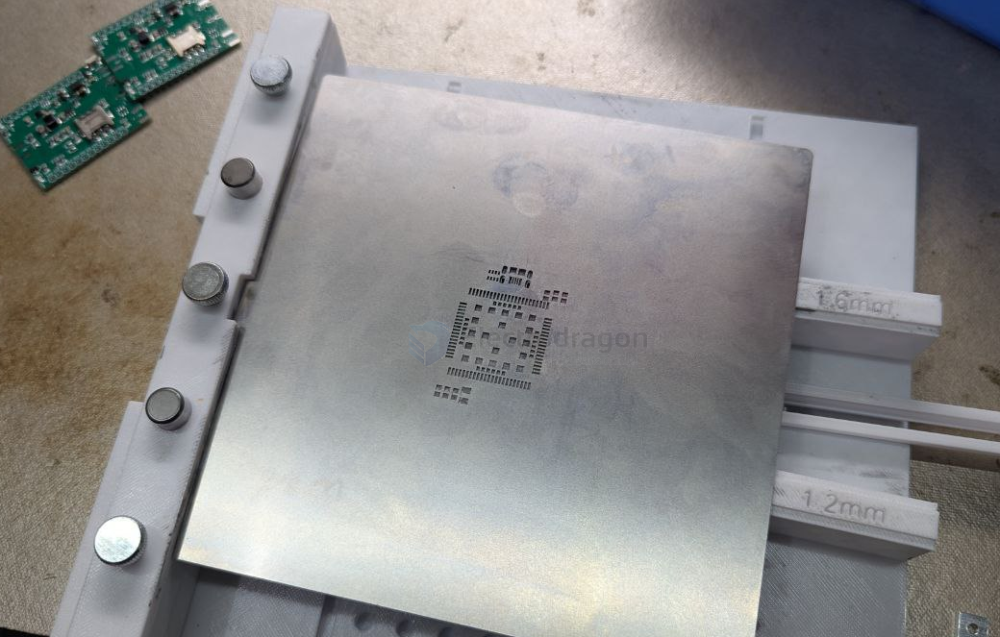

double side printer for - [[NGS1141-dat]]

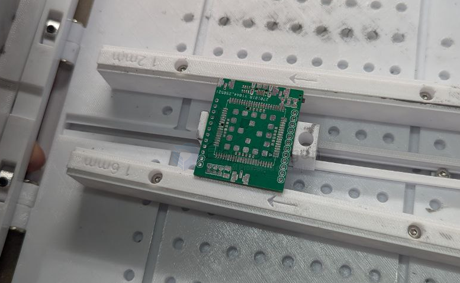

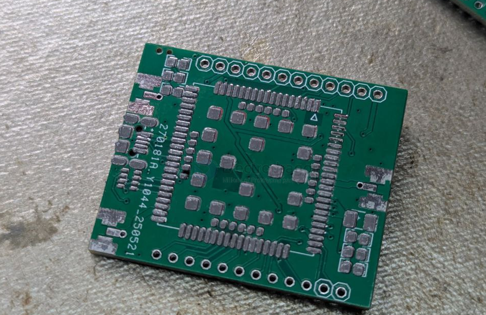

### other ideas 

cruved printer 

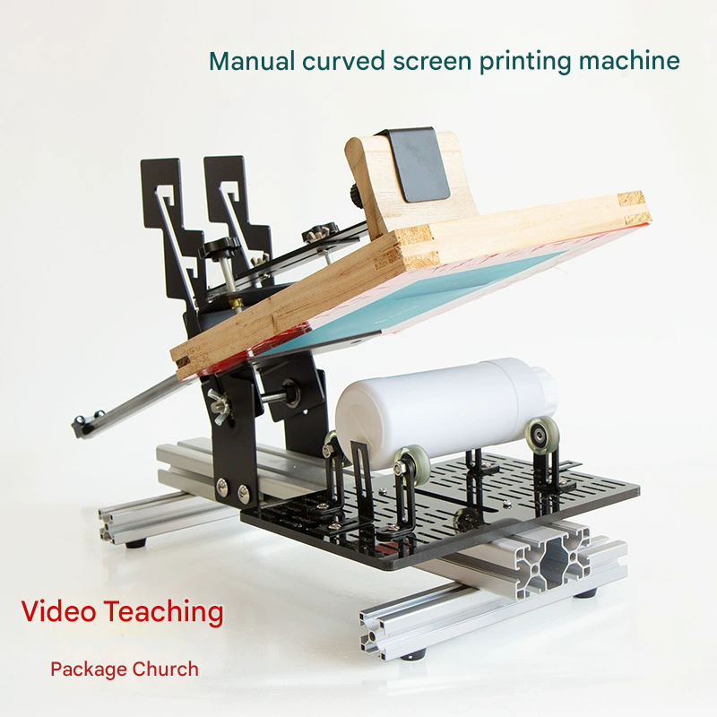

## ref 

- [[fab-stencil]] - [[fab-stencil-print]]