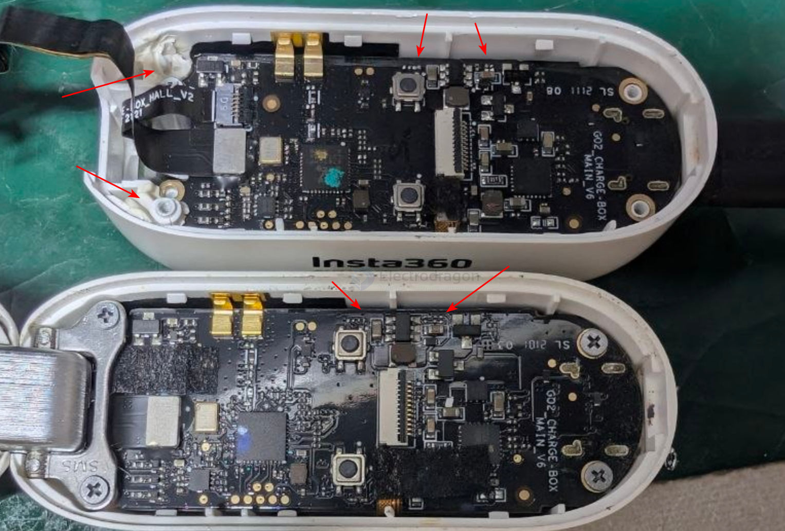
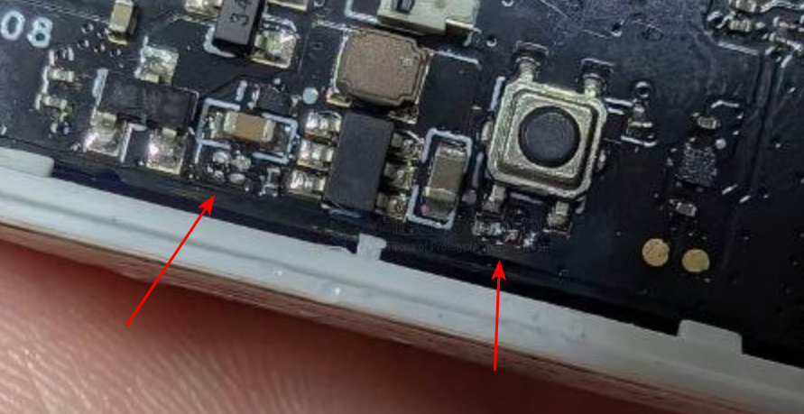
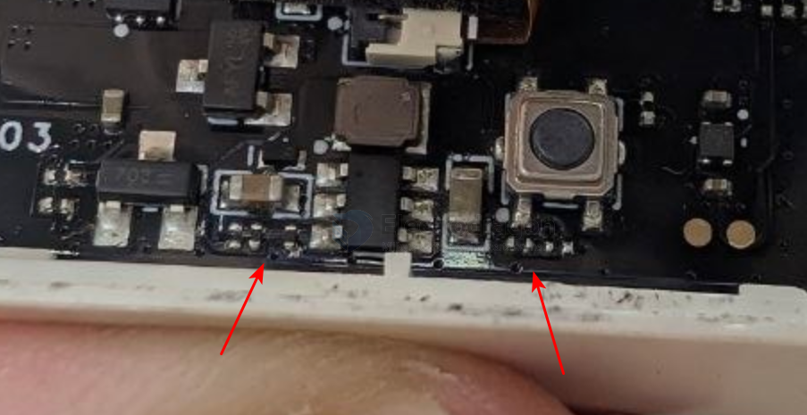
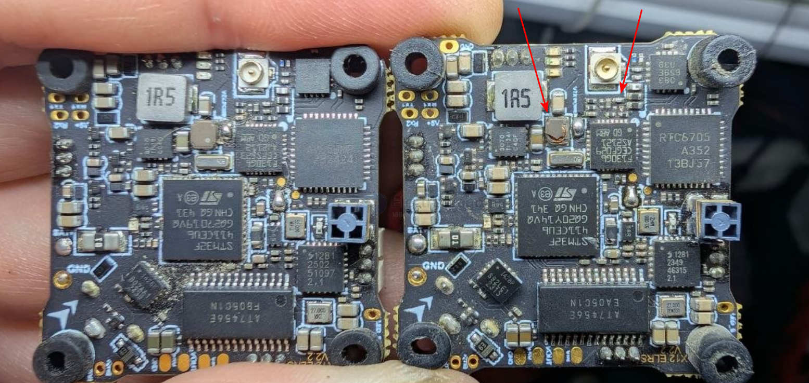
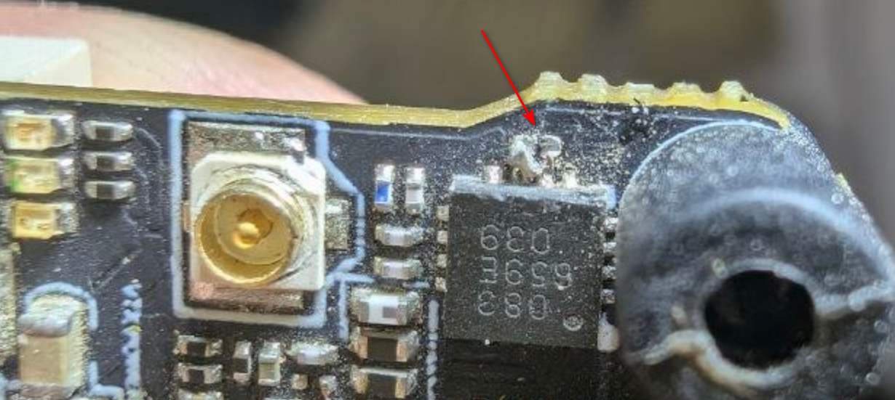

# PCB-fix-dat

- [[PCB-fix-dat]] - [[FPV-fix-dat]] - [[electronic-consumer-fix-dat]]

## app fixing and FIX scenario 

### app2 - consumer electronics  

- [[PCB-fix-dat]] - [[insta360-go2-dat]] - [[insta360-dat]]

- [[test-point-dat]]

### app1 - drop from a 3-meter height to concrete floor

- [[PCB-fix-dat]] - [[X12-dat]]

Multiple hidden physical defects caused by internal stress

① Cracked wire-wound inductor (case fractured)
*   The wire-wound inductor and its core are the heaviest / highest-inertia parts on the board, and the most brittle material (ferrite).
*   A shock wave of thousands of G is transmitted into the inductor, and the ferrite fractures brittlely (this is why you see the upper case cracked).

② Internal micro-cracks in the PCB layers and via barrel cracking ⭐️⭐️
*   The X12 is a multilayer board about 1.0mm thick (usually 4 layers), with a large number of 0.2~0.3mm diameter plated vias inside.
*   At the moment of impact, the PCB undergoes severe high-frequency bending deformation (PCB flexure).
*   Consequence: the surface copper and traces have good ductility, so no damage is visible to the naked eye; but the fragile inner-layer micro-vias and trace corners are pulled apart directly.
*   This perfectly explains:
    *   Why all 4 EFM8 signals are normal and main power is present, yet the power drive is completely dead (the main drive bus via is torn open).
    *   Why the camera goes black at the same time (the video line or a via broke in the same bending event).

③ Micro-debonding of SMD resistors/capacitors and chip solder joints (solder joint fatigue / pad cracking)

*   Lead-free solder (SAC305) is relatively brittle at room temperature when it comes to impact.
*   Severe vibration causes hair-thin micro-cracks at BGA/QFN chip pins (poor contact), and can even tear the copper pad under the surface solder mask.

*   Repair feasibility assessment:
    Because the break is inside the board layers (rather than a single burnt chip), even if you find one broken trace and fix it with a jumper wire, the other vias in a critically cracked state will break again on the next slight vibration or thermal expansion — extremely unreliable.
*   Best solution:
    This board has honorably completed its mission. It is recommended to keep it as a spare-parts board (the F411, ELRS receiver, EFM8 and MOSFETs on it are all good spare chips), and simply replace it for the fleet with a new X12 AIO V2.2 (or an upgraded compatible board) — mount the frame and 4 motors and it's back to full-power flight immediately!

compare 1 - [[X12-dat]] - [[PCB-fix-dat]] - [[FPV-fix-dat]]

broken - [[inductor-dat]] - [[capacitor-dat]]

broken 2 

- [[FC-AIO-dat]] - [[ESC-dat]] - [[X12-dat]] - [[test-point-dat]] == pin 4 (VCC) and 5 

- [[PCB-thermal-error-dat]] - [[VTX-dat]] == 75C

## tools 

- [[multimeter-dat]]

## issue detect 

important step 

analysis issues - [[PCB-defect-problem-analysis-dat]]

software check - [[betaflight-dat]] - [[PCB-fix-dat]]  - [[betaflight-motors-dat]]

by visual - **important to check missing parts**

**Bright light + magnifier / phone macro lens**
• What to look for: trace cracks, lifted pads, solder-bridge shorts
• Tip: shine light at a low angle — cracks will reflect

**Backside inspection**
• What to look for: board-layer cracks (impact damage)
• Tip: hold against a strong light — light passes through abnormally at cracks

**Oblique viewing**
• What to look for: cold joints / poor soldering
• Tip: a good joint is a smooth cone; a bad joint looks dull and has a crack ring

**Alcohol test**
• What to look for: hairline cracks
• Tip: apply alcohol — cracks will show up

**Comparison method**
• What to look for: compare against a known-good board of the same model
• Tip: differences in resistance readings and appearance

by tools == multimeter 

- [[mosfet-dat]] == short/thermal 

- [[motor-brushless-dat]] - resistance

- [[power-BEC-dat]] - power-supply

- [[VBAT-dat]] - resistance-range - resistance

- [[ESC-dat]] - thermal/power-supply

- [[MCU-dat]] - power-supply

- [[chip-dat]] - [[power-dat]]

## other concern and methods 

- [[software-dat]] - [[SDK-dat]]

- [[PCB-fix-dat]] - [[PCB-error-dat]] - [[circuits-short-dat]]

- [[PCB-mechanical-error-dat]] - [[fab-mechanics-dat]] - [[PCB-fix-dat]] - 

- [[PCB-signal-error-dat]] - [[signal-dat]] - [[PCB-fix-dat]]

- [[PCB-thermal-error-dat]] - [[PCB-fix-dat]] - [[thermal-dat]]

## workflow

1. 目视（放大镜找裂纹/烧痕）
2. 酒精蒸发法找发热元件 ⭐️
3. 通断测试查走线
4. 按压测试查虚焊
5. 可疑焊点热风枪补焊 → 复测

extra workflow

- examine the output of the power tree from [[dcdc-down-dat]] - [[LDO-dat]] 

## difficulties 

- [[BGA-dat]] 

## edit 

- [[PCB-cutter-dat]]

### mess editing 

- also suitable for single trace editing 
- Use a drill to make non-through holes to break PCB traces
- fast for large batch fixing 

## ref 

- [[PCB-dat]] - [[circuits-dat]]

- [[PCB]] - [[PCB-fix]]