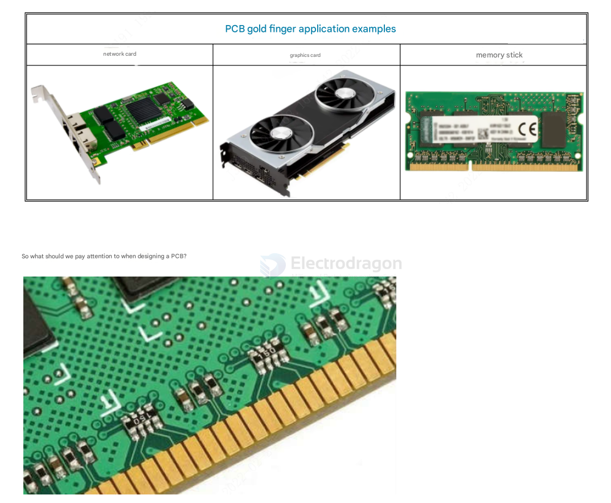
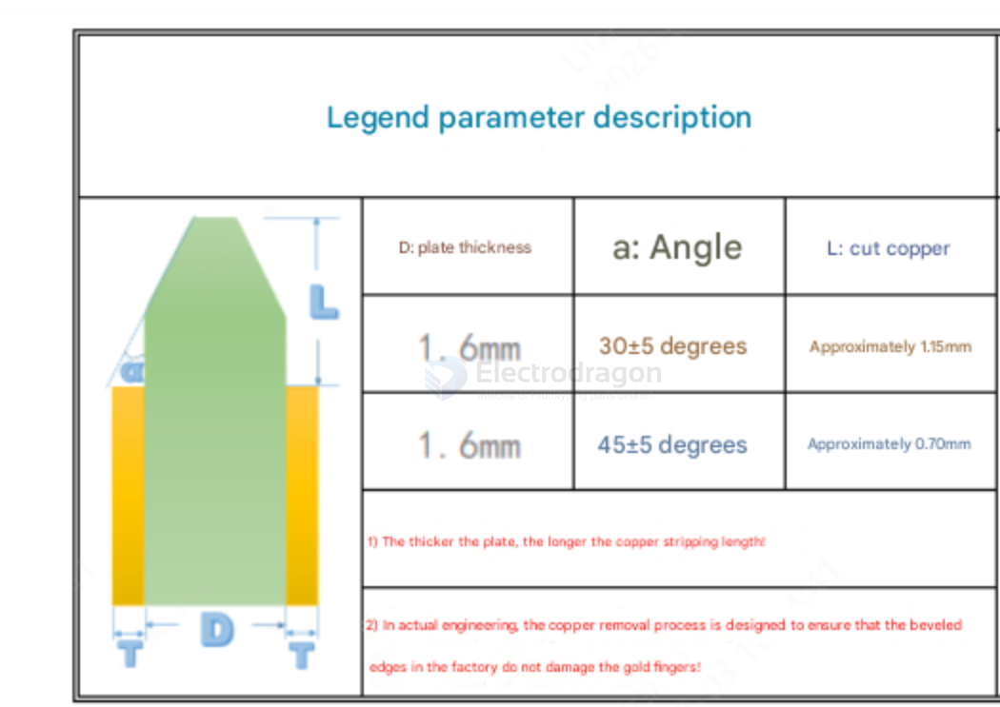
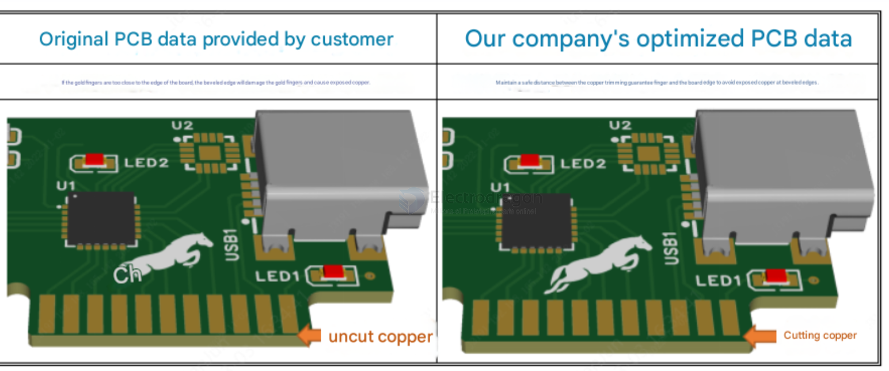
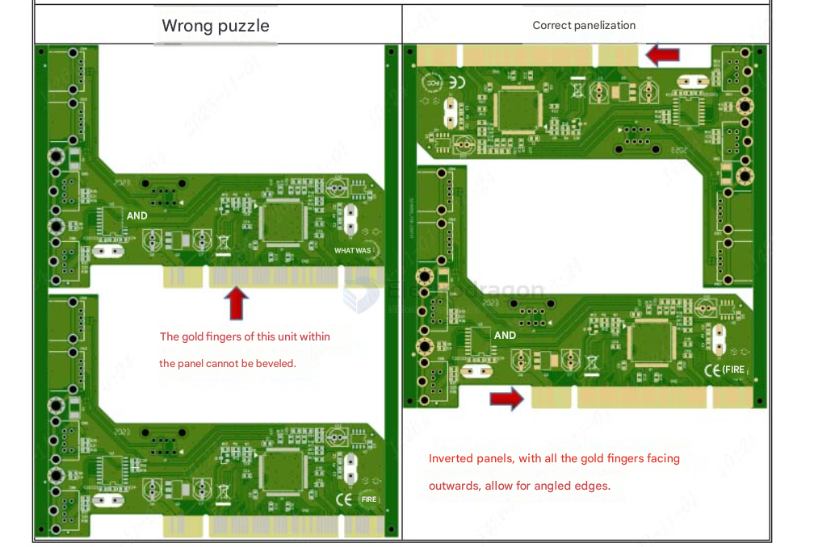

# PCB-gold-fingers-dat

## optimize 

Excessively deep bevels on PCB gold fingers can prevent them from making proper contact with compatible devices during assembly, or result in poor contact, thus affecting usability.

Therefore, during design, it is crucial to ensure the length, width, and position of the gold fingers. The bevel angle and depth of the gold fingers should be consistent with the finger length. Avoid creating fingers that are too short or too thin after beveling, which would render them unusable. Simultaneously, ensure a safe distance between the edge of the gold finger and the edge of the board. For bevels below this safe distance, our engineers will optimize the process. Angles of 30 degrees and 45 degrees are available. A 30° bevel is easier to insert and remove compared to a 45° bevel; we recommend prioritizing 30°, as explained below:

If the gold fingers are too close to the board edge, a beveled edge can damage them, leading to exposed copper.

Copper trimming ensures a safe distance between the gold fingers and the board edge, preventing exposed copper from beveled edges.

## penalization 

## ref 

