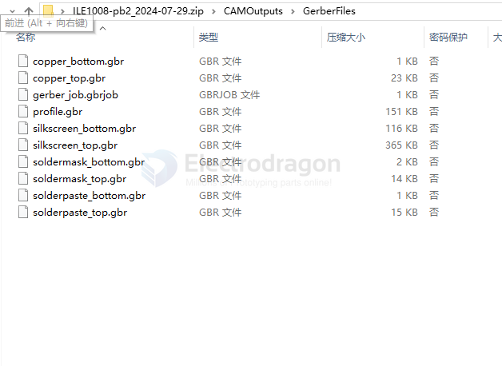

# PCB-layers-dat

- [[PCB-gerber-dat]] - [[PCB-layers-dat]]

- from - [[eagleCAD-dat]]

- [[PCB-format-dat]]

## Common gerber files for (in a .zip)

layers - gerber - [[gerber-dat]]
- copper 
- profile
- silkscreen
- soldermask - [[PCB-solder-mask-dat]]
- solderpaste

- [[PCB-format]]

## kicad 

| default     | kicad         | eagleCAD | gerber | description |
| :---------- | :------------ | :------- | :----- | :---------- |
|             | F.Cu          |          | need   |             |
|             | B.Cu          |          | need   |             |
|             | F.Adhesive    |          |        |             |
|             | B.Adhesive    |          |        |             |
| solderPaste | F.Paste       |          | need   |             |
| solderPaste | B.Paste       |          | need   |             |
|             | F.Sillkscreen |          | need   |             |
|             | B.Silkscreen  |          | need   |             |
| soldermask  | F.Mask        |          | need   |             |
| soldermask  | B.Mask        |          | need   |             |
|             | User.Drawings |          |        |             |
|             | User.Comments |          |        |             |
|             | User.Eco1     |          |        |             |
|             | User.Eco2     |          |        |             |
|             | Edge.Cuts     |          | need   |             |
|             | Margin        |          |        |             |
|             | F.Courtyard   |          |        |             |
|             | B.Courtyard   |          |        |             |

## ref 

