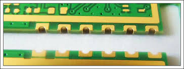
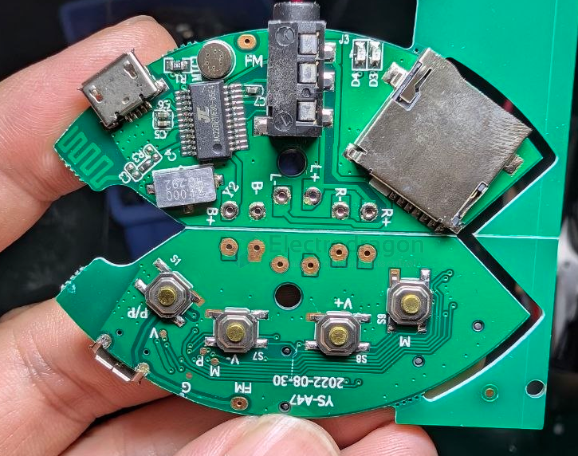

# PCB-penalization-design-dat

- [[PCB-penalization-design-dat]] - [[fab-penalization-dat]]

- [[PCB-design-basic-dat]] - [[PCB-stack-dat]] - [[PCB-form-dat]] - [[PCB-penalization-dat]]

## methods 

#### Castellated holes

Castellated holes, please make sure your board are designed correctly: Place holes, add V-cuts, etc

# penalization-dat

- [[many-penalization-examples-dat]]

## build

- [[PCB-penalization-dat]] - [[PCB-form-dat]] - [[jieli-dat]]

## obseleted 

* [http://dl.electrodragon.com/k/index.php?share/file&user=1&sid=wsIZnGKW 1. Eagle penalize and export gerber file]
* [http://dl.electrodragon.com/k/index.php?share/file&user=1&sid=eKTRh7b3 2. detailed panelized tutorial]

## ref

- [[stamp-holes-dat]]

- [[拼板]]

