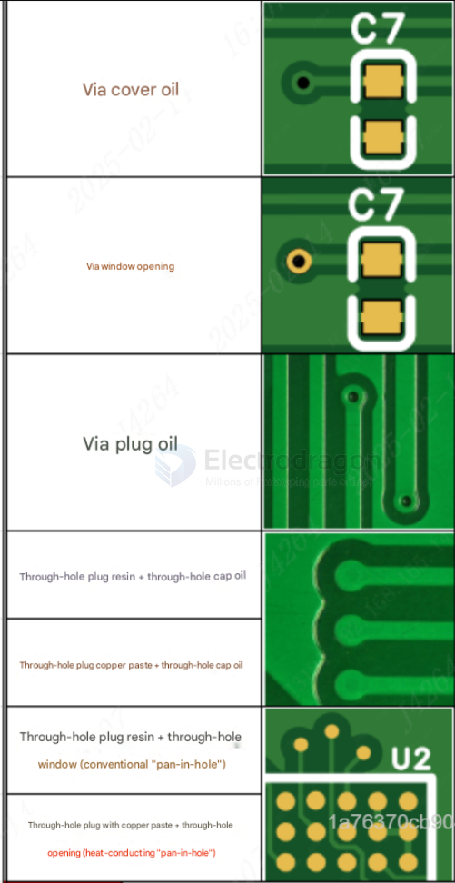

# Solder Mask

## Via Covering Types

This page summarizes common via covering and plugging types used in PCB manufacturing.

---

## 1. Tented Via

**Definition:**
After the via wall is copper plated, solder mask ink covers the via pad. Some ink may flow into the hole. No solder should remain on the pad surface. Slight yellowing around the via opening is considered normal.

**Inspection standard:**
The via pad should not take solder during wave soldering or manual soldering.

---

## 2. Via Opening

**Definition:**
After copper plating, the via pad is left exposed instead of being covered by solder mask. The exposed copper surface is then finished with HASL or ENIG. If HASL is used, some solder may remain inside the hole.

**Inspection standard:**
The via pad should solder normally during wave soldering or manual soldering.

---

## 3. Via Plugging with Solder Mask Ink

**Definition:**
After copper plating, solder mask ink is filled into the via, and then the full board is coated with solder mask. The via pad surface is also covered with ink. The plugging rate can reach more than 98%.

**Inspection standard:**
- yellow opening rate on via pads: < 5%
- pad surface should not take solder
- light-blocking rate of plugged vias: ≥ 95%

---

## 4. Resin Plugged Via

**Definition:**
After copper plating, the via is filled with epoxy resin and then copper plated flat on the surface. The plated area and via pad are then covered with solder mask, which gives better protection and makes the hole less visible from the surface.

**Applicable via size:**
$0.15 \, \text{mm} \text{ to } 0.55 \, \text{mm}$

**Inspection standard:**
- no light transmission
- covered pads should print ink normally
- opened pads should support normal HASL or ENIG finishing

---

## 5. Copper Paste Filled Via

**Definition:**
This process uses high-thermal-conductivity copper paste to fill the via after copper plating, followed by surface copper plating and solder mask covering. It protects the via and also improves current carrying and heat transfer performance.

**Thermal conductivity:**
$8\,W/(m\cdot K)$

**Applicable via size:**
$0.15 \, \text{mm} \text{ to } 0.55 \, \text{mm}$

**Inspection standard:**
- no light transmission
- covered pads should print ink normally
- opened pads should support normal HASL or ENIG finishing

