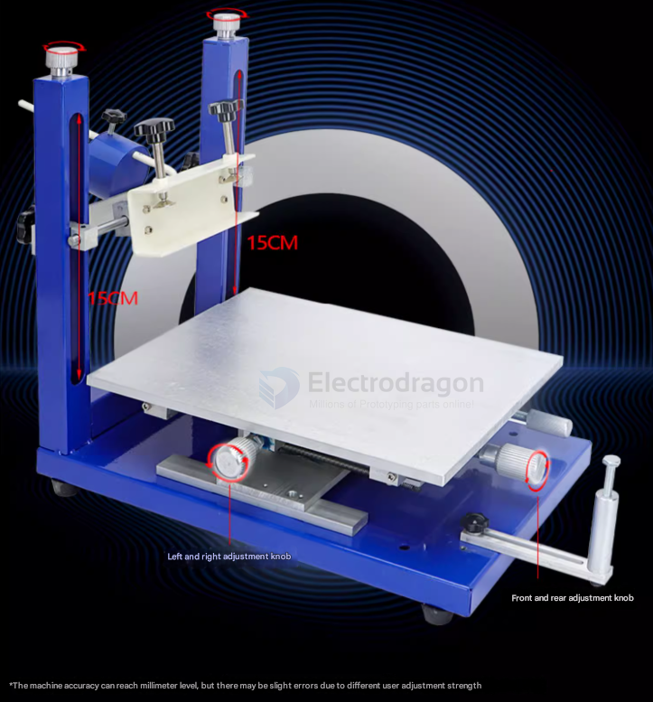

# solder-paste-dat

- [[high-precise-printing-dat]]

## solder dross issue 

### How to Fix "Grey" or Oxidized Solder Joints

Grey joints are usually caused by **overheating** (burning off the flux), **underheating** (cold joints), or **slow cooling**. Follow these steps to "refresh" the joints:

---

### 1. The "Flux-and-Reflow" Method (Best for SMD)
If the joint is just dull but the component is correctly aligned, **Flux** is your best friend.
* **Apply Tacky Flux:** Cover the grey joints with a generous amount of high-quality "no-clean" or RMA tacky flux (e.g., Amtech NC-559).
* **Re-apply Heat:** * **Hot Air Station:** Set to ~280°C - 300°C with low airflow. Heat the area until you see the solder turn liquid and "jump" into a shiny, spherical shape.
    * **Soldering Iron:** Touch the joint briefly with a clean, tinned tip. The flux will smoke and chemically "eat" the grey oxide layer.
* **Why it works:** Flux is a reducing agent. It chemically removes the oxygen from the "grey" tin-oxide and allows the pure metal to flow together again.

### What happens inside the can at $30^\circ\text{C}$?

1.  **Flux Separation (The "Oil" Effect):** Solder paste is a suspension of heavy metal spheres in a lighter chemical flux. At $30^\circ\text{C}$, the flux becomes less viscous. The heavy solder powder will settle to the bottom, and a yellowish, oily liquid (the flux) will rise to the top.
    
2.  **Chemical Activity Loss:** Flux is designed to "activate" (clean oxides) at high temperatures. However, at $30^\circ\text{C}$, a slow chemical reaction begins prematurely. The flux starts "working" on the solder powder while it's still in the can, exhausting its strength before it ever touches your PCB.

3.  **Powder Oxidation:** Even in a "sealed" plastic can, there is trapped air (oxygen) inside. Heat acts as a catalyst. The microscopic surface area of the solder spheres is massive, and $30^\circ\text{C}$ provides enough energy for a thin layer of **Tin Oxide** ($SnO$ or $SnO_2$) to form on every single sphere.

---

### How to tell if your paste is "dead"
Before using it on a real project, perform these three checks:

* **The Stir Test:** Open the can. If there is a thick layer of liquid on top, try to stir it back in. If it remains "chunky," "dry," or like "wet sand" that won't smooth out, the flux has evaporated or polymerized. **Throw it away.**
* **The Slump Test:** Apply a small amount to a surface. If it spreads out and loses its shape (slumps) at room temperature, it will likely cause "solder bridges" (连锡) during reflow.
* **The Solder Ball Test:** Put a small dab on a piece of scrap PCB and heat it with a heat gun. 
    * **Good:** The paste melts into one single, shiny, beautiful silver ball.
    * **Bad:** The paste melts but leaves behind dozens of tiny "satellites" (small grey dust-like balls) around the main drop. This is a sign of heavy oxidation.

---

### Comparison of Storage Conditions
| Storage Temp | Expected Shelf Life | Resulting Quality |
| :--- | :--- | :--- |
| **$0\text{--}10^\circ\text{C}$ (Fridge)** | 6–12 Months | **Professional Grade.** Shiny joints, minimal dross. |
| **$20\text{--}25^\circ\text{C}$ (Room)** | 1–2 Months | **Acceptable for DIY.** May require extra flux. |
| **$30^\circ\text{C}+$ (Warm)** | < 3 Weeks | **Poor.** High risk of grey joints and solder beads. |

---

### Can you fix it?
If you *must* use this paste and it has separated:
1.  **Manual Homogenization:** Stir it vigorously for at least 2–3 minutes with a clean spatula until it looks like creamy peanut butter.
2.  **Add "Fresh" Flux:** If the paste feels dry, add a few drops of high-quality **Tacky Flux** (like NC-559) and mix it in. This can sometimes "rescue" oxidized powder by providing the extra cleaning power needed to break through the $30^\circ\text{C}$ oxide layer.

## “Solder paste should be more viscous so it doesn’t spread or drip.”

- **More viscous** → thicker, stickier, flows slowly  
  → Good for solder paste — it stays where you apply it.

- **Diluted** → thinned by adding liquid (like flux or solvent)  
  → Not good — it becomes too runny and won’t hold components well.

## Low temperature soldering paste

Low temperature soldering paste is a type of solder paste designed to melt and flow at lower temperatures than standard solder pastes. Here are its main features:

- Melting Point: Typically melts between 130°C and 180°C, compared to standard lead-free solder pastes which melt around 217°C.
- Composition: Often contains bismuth-based alloys (e.g., Sn42/Bi58) instead of traditional tin-silver-copper (SAC) alloys.
- Applications: Ideal for temperature-sensitive components, rework, or double-sided PCB assembly where high heat could dam-Age parts.
- Reduced Thermal Stress: Minimizes risk of warping or dam-Aging PCBs and components.
- Energy Saving: Lower reflow oven temperatures reduce energy consumption.
- Compatibility: Useful for mixed-technology boards or assemblies with plastic connectors and LEDs.

### Solder Paste Types and Applications

| Solder Paste Model   | Composition         | Powder Type | Application/Notes                                   |
| -------------------- | ------------------- | ----------- | --------------------------------------------------- |
| Mobile Repair GY618B | Sn62.8-Pb36.8-Ag0.4 | Type 4      | For mobile phone repair                             |
| A-888                | Sn63-Pb37           | Type 3      | resistors, capacitors, simple IC PCBs               |
| A-888                | Sn63-Pb37           | Type 4      | resistors, capacitors, fine-pitch/multi-pin IC PCBs |
| SMT Chip A-888       | Sn63-Pb37           | Type 5      | resistors, capacitors, dense/multi-pin IC PCBs      |
| GY-626B              | Sn62.9-Pb36.9-Ag0.2 | Type 4      | QFN type PCBs                                       |
| GY-618B-B            | Sn62.8-Pb36.8-Ag0.4 | Type 4      | BGA pack-Age PCBs                                   |
| LED Chip GY361       | Sn55-Pb45           | Type 3      | LED lamps, strips, and tapes                        |
| GY638A               | Sn60-Pb40           | Type 3      | Performance superior to GY361                       |

## target 

- [[FPC-dat]] 

## Common type Solder Paste 

| melting point | tin content | Note                                                                 |
| ------------- | ----------- | -------------------------------------------------------------------- |
| 138 C         | 42%         | ultra-low temperature, bismuth-based, for special low-temp soldering |
| 150 C         | 42%         | low temperature, bismuth-based, for temperature-sensitive components |
| 183 C         | 63%         | best for most common PCB, small spacing, high parts density          |
| 217 C         | 99.3%       | lead-free, SAC305 alloy, standard for RoHS compliant PCBs            |

## solder paste printer 

## ref 

- [[solder-paste]]

- [[soldering-dat]]