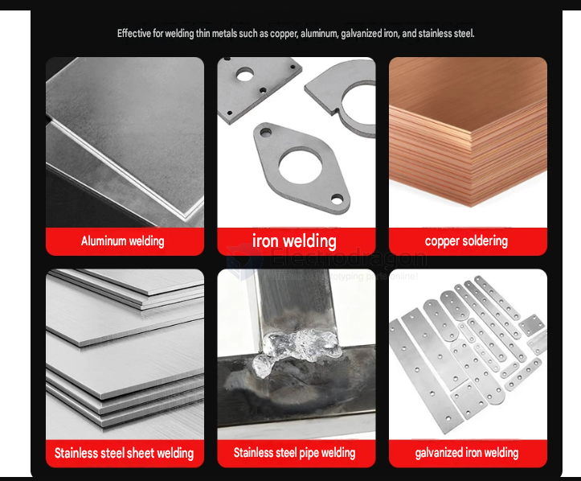
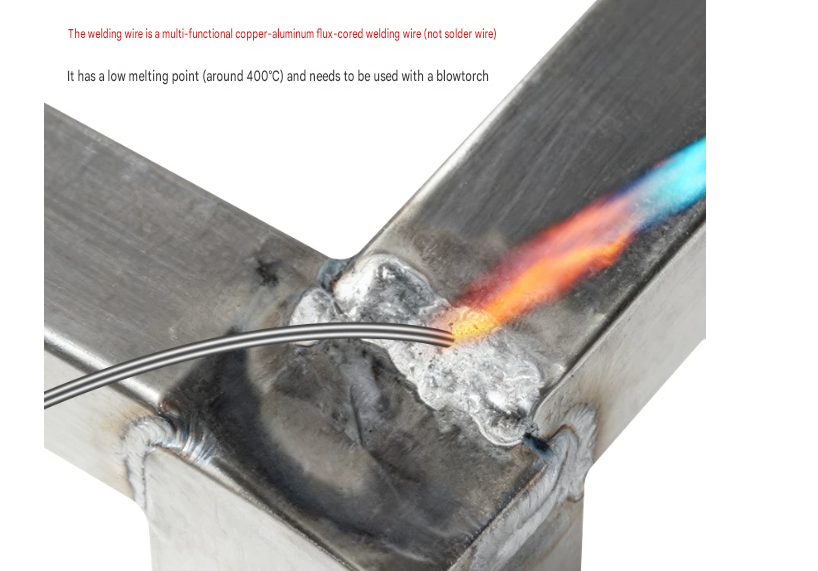
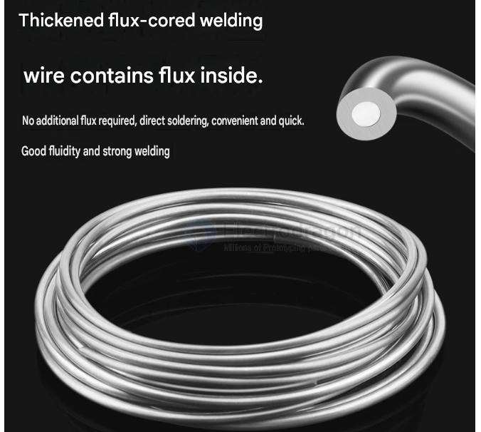

# Flux-Core-dat

- [[Flux-Core-dat]] - [[fab-soldering-materials-dat]]

## What is Copper-Aluminum Flux-Cored Welding Wire?

**Copper-Aluminum Flux-Cored Welding Wire** is a highly efficient welding material specifically designed for the **heterogeneous joining of copper and aluminum (or aluminum alloys)**. 

Its defining feature is its unique structure: **the outer layer consists of a hollow aluminum-silicon alloy sheath (typically aluminum-based), while the inner core is filled with a powdery, non-corrosive fluoride-based flux (the "flux core")**.

### How It Works

Traditional copper-to-aluminum welding requires manual application of flux (powder or paste) while feeding a solid wire, which is a tedious process often leading to uneven distribution. 

Flux-cored wire completely solves this pain point:
1. **Self-Contained Flux:** During heating, the flux core sealed inside melts first.
2. **Oxide Layer Removal:** The molten flux spreads rapidly, chemically removing the metallic oxide film from the copper and aluminum surfaces to prevent re-oxidation.
3. **Perfect Wetting:** Immediately after, the outer aluminum-silicon sheath melts. Driven by the wetting action of the flux, the molten metal smoothly flows into and fills the joint, establishing a high-strength copper-to-aluminum bond.

---

### Core Advantages

* **Extremely Simple Operation:** No need to apply separate flux manually. It achieves true "pick-up-and-weld" convenience, significantly boosting efficiency.
* **Eco-Friendly & Clean:** The internal core typically uses a **non-corrosive flux**. Post-welding residues do not absorb moisture, are non-corrosive, and generally **do not require cleaning**, preventing long-term corrosion of the base metals.
* **High-Quality Joints:** Thanks to the precise and uniform distribution of the internal flux, the molten metal exhibits excellent fluidity and penetration, minimizing porosity and cold joints.
* **Low Melting Point:** Its melting point typically ranges between 400°C and 500°C (brazing range). This is well below the melting point of copper, protecting thin copper tubes or aluminum parts from damage caused by overheating.

---

### Primary Applications

Because copper and aluminum have a large galvanic potential difference and distinct hardness levels, joining them through direct fusion welding is extremely difficult. Copper-aluminum flux-cored wire is currently the mainstream solution across the **refrigeration, electronics, and electrical industries**:

* **Refrigeration & HVAC:** Splicing and repairing copper-to-aluminum tubes or aluminum fins in air conditioner and refrigerator condensers and evaporators.
* **Electrical & Power Grid:** Welding copper-aluminum joints, transformer/reactor coils, and copper-to-aluminum transition busbars.
* **Electronics:** Welding copper and aluminum tabs on lithium batteries, lead wires, etc.

---

### Common Heating Methods
This wire is highly versatile and can be heated using various tools:
* **Flame Brazing:** The most common method (e.g., using portable torches, oxy-acetylene setups).
* **Induction Brazing:** Ideal for high-frequency, automated mass production on factory assembly lines.

## What is a Flux Core?

In the welding and brazing industry, a **flux core** refers to the **powdery additive (flux, protective agent, or slag-former) encapsulated inside a hollow metal wire**.

To put it simply: while a traditional welding wire is a solid metal rod, a **flux-cored wire** acts like a "hollow straw." The wall of the straw is made of metal, and the center is packed with a proprietary blend of chemical powders—this is the **flux core**.

---

### Composition and Role of the Flux Core

The flux core is not a single ingredient; it is a precisely engineered mixture of minerals, ferroalloys, metal powders, and chemical compounds. During the welding or brazing process, it performs several critical functions:

#### 1. Cleaning the Oxide Film (De-oxidation)
Metal surfaces exposed to air form an invisible oxide layer (such as aluminum oxide on aluminum or copper oxide on copper). These layers have very high melting points and block metals from fusing. Once heated, the flux core melts and chemically **strips away this oxide film**, exposing pristine metal for bonding.

#### 2. Preventing Secondary Oxidation (Shielding)
As it melts, the core ingredients react to generate shielding gases or form a physical layer of molten slag. This **shields the weld zone from ambient air (oxygen and nitrogen)**, preventing the hot metal from re-oxidizing and averting defects like porosity or blowholes.

#### 3. Improving Fluidity (Wetting)
The flux significantly reduces the surface tension of the molten filler metal, allowing the liquid alloy to **flow smoothly, penetrate deeply, and fill every micro-gap in the joint** for a reliable bond.

#### 4. Modifying Weld Properties (Alloying)
In industrial arc welding (FCAW), the core often includes specific alloying elements (such as manganese, silicon, or chromium). The core melts into the weld pool to **enhance the mechanical properties of the weld metal**, upgrading its overall strength, toughness, or wear resistance.

---

### Why Package It as a "Core"? (Vs. Traditional Methods)

Before the widespread adoption of flux-cored wires, operators had to manage a two-step routine: holding the wire in one hand and a tub of flux powder or paste in the other, applying the flux manually before heating. 

Integrating the flux directly into the core of the wire revolutionized the process:

* **All-in-One Convenience:** Eliminating the need for separate flux creams or powders streamlines workflow and drastically increases productivity.
* **Precise Proportions:** The ratio of flux to metal is fixed per centimeter of wire. Manual application often risks using too much flux (causing messy residue and corrosion) or too little (resulting in weak joints). A flux-cored wire guarantees consistent quality.
* **Ready for Automation:** Flux-cored wires can be wound continuously onto large spools. When paired with automatic wire feeders, they are optimized for robotic arms and industrial assembly lines.

## ref 

- [[flux-core]] - [[fab-soldering-materials]] - [[fab]]