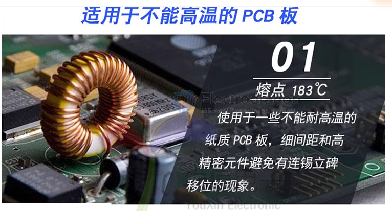
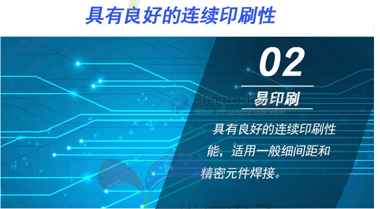
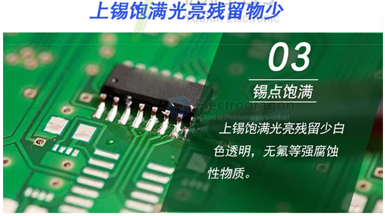
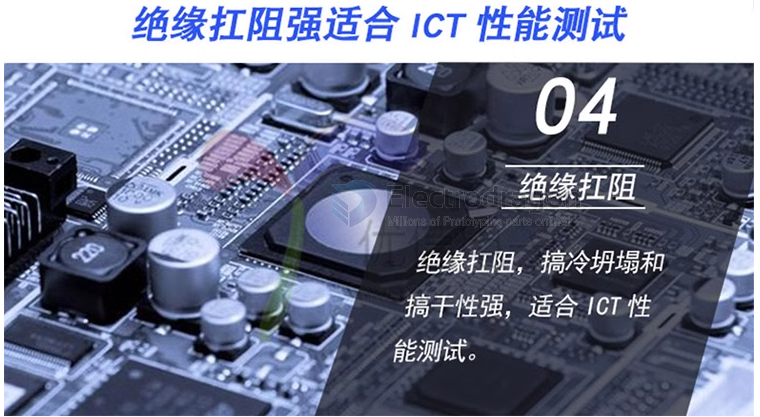

# solder-paste-dat

- [[soldering-paste-low-temperature]] - [[solder-paste-dat]] - [[fab-soldering-materials-dat]]

- [[PCB-soldering-dross-dat]] - [[fab-PCB-soldering-dat]] - [[flux-thinner-dat]]

- [[high-precise-printing-dat]]

- [[fab-PCB-soldering-dat]] - [[solder-paste-dat]]

- [[fab-stencil-printer-dat]] - 

## supporting tools 

- [[syringe-dat]] - [[syringe-pusher-dat]]

- [[Flux-Thinner-dat]]

- [[soldering-flux-dat]]

### Solder Paste Types and Applications

| Solder Paste Model   | Composition         | Powder Type | Application/Notes                                   |
| -------------------- | ------------------- | ----------- | --------------------------------------------------- |
| Mobile Repair GY618B | Sn62.8-Pb36.8-Ag0.4 | Type 4      | For mobile phone repair                             |
| A-888                | Sn63-Pb37           | Type 3      | resistors, capacitors, simple IC PCBs               |
| A-888                | Sn63-Pb37           | Type 4      | resistors, capacitors, fine-pitch/multi-pin IC PCBs |
| SMT Chip A-888       | Sn63-Pb37           | Type 5      | resistors, capacitors, dense/multi-pin IC PCBs      |
| GY-626B              | Sn62.9-Pb36.9-Ag0.2 | Type 4      | QFN type PCBs                                       |
| GY-618B-B            | Sn62.8-Pb36.8-Ag0.4 | Type 4      | BGA pack-Age PCBs                                   |
| LED Chip GY361       | Sn55-Pb45           | Type 3      | LED lamps, strips, and tapes                        |
| GY638A               | Sn60-Pb40           | Type 3      | Performance superior to GY361                       |

## Common type Solder Paste 

| melting point | tin content | Note                                                                 |
| ------------- | ----------- | -------------------------------------------------------------------- |
| 138 C         | 42%         | ultra-low temperature, bismuth-based, for special low-temp soldering |
| 150 C         | 42%         | low temperature, bismuth-based, for temperature-sensitive components |
| 183 C         | 63%         | best for most common PCB, small spacing, high parts density          |
| 217 C         | 99.3%       | lead-free, SAC305 alloy, standard for RoHS compliant PCBs            |

## target 

- [[FPC-dat]] 

## ref 

- [[solder-paste]]

- [[fab-PCB-soldering-dat]]