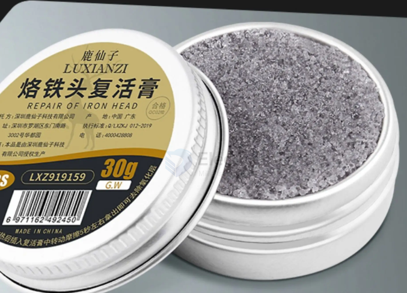

# soldering-iron-tip-refresher-dat

- [[soldering-iron-dat]] - [[soldering-iron-tip-dat]] - [[soldering-iron-tip-refresher-dat]]

化学还原（助焊剂/复活膏）： 所谓的“烙铁头复活膏”通常含有高活性的还原剂（如氯化铵或特殊的有机酸）。在高温下，这些成分会发生化学反应，将金属氧化物还原为金属状态，或者将其转化为易于清理的化合物。

## ref 

- [[fab-PCB-soldering-tools]] - [[soldering-iron]]