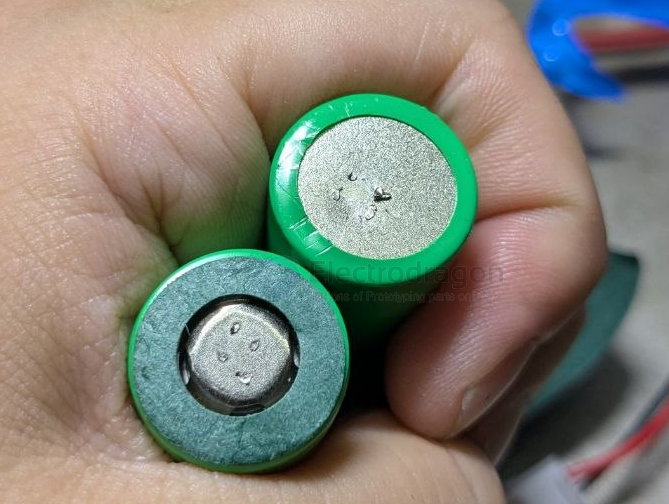

# Battery Spot Welding and Desoldering

- [[battery-dat]] - [[fab-tools-dat]] - [[battery-tools-dat]] - [[battery-tester-dat]]
- [[fab-soldering-materials-dat]]

## Capacitor Discharge (CD) Spot Welding

Capacitor Discharge Spot Welder (CD Spot Welder)

Capacitors are not batteries; they can be stored at zero volts, require no maintenance over long periods, have no memory effect, and do not suffer from over-discharge issues. They can be used normally even after being shelved for 2 years.
- Extremely high-current discharge capability.
- A long-term practical tool, not a short-term toy!

- [[capacitor-super-dat]] - [[capacitor-dat]]

Specifically for [[battery-dat]]

- Laser Nickel Welding??

## Desoldering: Removing Nickel Strips

### Method 1: Using Specialized Wire Strippers or Diagonal Cutters (Recommended & Safest)
This is the most common manual disassembly method. The core technique is "rolling" rather than "pulling hard."

- **Tools:** Sharp needle-nose pliers, diagonal cutters, or wire strippers (with insulated handles).
- **Find a Point of Entry:** Look for a slightly raised edge on the nickel strip and grip it with the cutters.
- **"Sushi Roll" Technique:** Never pull straight up vertically (this can deform or puncture the battery's positive cap). Instead, grip one end of the nickel strip and rotate the pliers in one direction—like opening a can or rolling sushi—to slowly wind the nickel strip around the plier jaws.
- **Clean Up:** After removing the main strip, small protrusions (residual weld spots) often remain. Use the tip of the diagonal cutters to carefully flatten or snip them off.

### Method 2: Using a Micro Rotary Tool or Sandpaper (For Precision)
Ideal if you want to avoid physical stress on the battery or desire a perfectly smooth finish.

- **Tools:** Handheld micro rotary tool (with ball or cylindrical grinding stones, diamond bits), and safety goggles.
- **Precision Grinding:** Aim the rotary tool at the weld spot and gently grind down the nickel strip until it naturally detaches.
- **Precautions:**
    - **Temperature Control:** Li-ion batteries are heat-sensitive. Grind in short bursts to prevent overheating the terminal.
    - **Prevent Shorts:** Metal dust is conductive. Ensure flying debris does not bridge the positive terminal and the negative casing.

### Method 3: Using a Flat-head Screwdriver or Pry Bar (For Bulk Initial Disassembly)
- **Tools:** Small insulated flat-head screwdriver or a hard plastic pry bar.
- **Operation:** Insert the flat head into the gap between the nickel strip and the battery. Apply horizontal force and use leverage to pry it upwards.
- **Short Circuit Prevention:** If using a metal screwdriver, wrap the shaft with electrical tape, leaving only the very tip exposed. When working on the positive terminal, the screwdriver must NEVER touch the negative casing at the bottom!

## ⚠️ Golden Rules: Safety Precautions (Extremely Important)

During disassembly, strictly adhere to the following safety rules:

1.  **Prevent Shorts:** When disassembling series or parallel battery packs, handle only one weld spot at a time. When cutting wires, **NEVER** use scissors/cutters to cut both positive and negative wires simultaneously (metal tools will cause a high-current short).
2.  **Protect the Positive Insulation Ring:** The paper or plastic gasket (barley paper/insulation washer) on the positive head of an 18650 cell is critical for isolating the poles. Do not lose or damage this ring while tearing off the nickel strip.
3.  **Wear Protective Gear:** Always wear safety goggles and puncture-resistant gloves.
4.  **Emergency Preparedness:** Operate in a well-ventilated area with an empty metal bucket or sand nearby. If a battery starts smoking or becomes excessively hot, immediately use pliers to drop it into the bucket or sand. **NEVER** grab it with your hands.

## References 

- [[battery-dat]]
- [[soldering-tools-spot-welding]] - [[soldering-tools]]