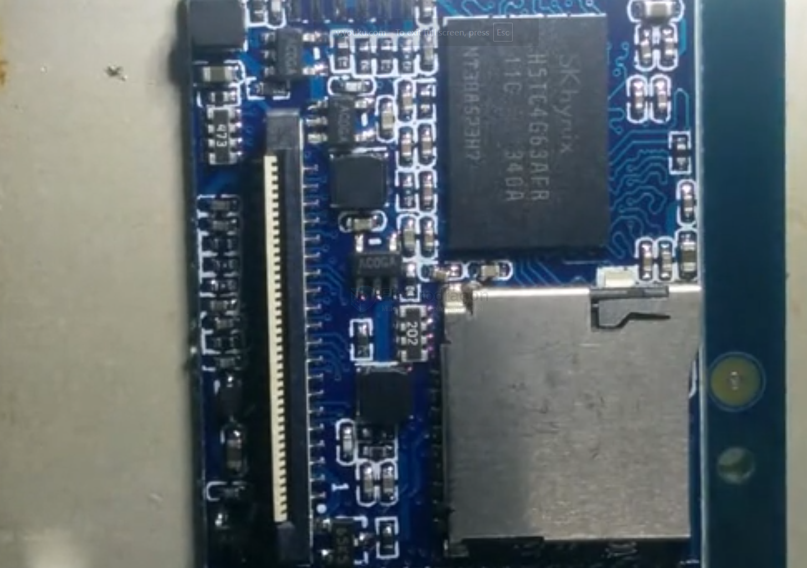
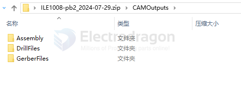

# PCBA-dat

- [[PCB-soldering-dat]] - [[desoldering-dat]]
  
- [[spot-welding-dat]] 

- [[solder-paste-dat]] - [[soldering-tools-dat]]

- [[PCB-dat]]

- [[PNP-machine-dat]] - [[reflow-machine-dat]] 

- [[PCB-cleaner-dat]]

## soldering under microscope 

- [[RP2040-dat]]

## PCBA 

- include extra assembly, files 
  

## PCBA Design 

- [[PCB-dat]]

- [[penalization-dat]] - [[EDA-dat]]

# PCB-make-dat

- [[mark-point-dat]] - [[export-coordinate-dat]]

## make machine 

[[machine-dat]] - [[pnp-machine-dat]]

## PCB protection service 

- for this module, consider add - Adhesive Solutions on PCBs - [[PCB-Adhesive-dat]]
- or layered plastic case [[layered-case-dat]]
- more simple soltuion - [[PMP1037-dat]]

## Automated Methods to Check Complex Footprints (Unsoldered Pads)

- [[AOI-dat]] - [[ICT-dat]]

- [[E-test-dat]] 

- **E-Test is for the bare PCB (before assembly).**
- It checks copper traces, vias, and pads for:
  - **Short circuits** (unwanted connections between nets).
  - **Open circuits** (broken or missing connections).
- Done by the PCB manufacturer using a **flying probe tester** or a **bed-of-nails fixture**.
- Ensures the **bare board matches the Gerber/netlist** before any components are soldered.

| Method                        | How It Works | Pros | Cons |
|-------------------------------|-------------|------|------|
| **Automated Optical Inspection (AOI)** | High-resolution cameras scan PCB to compare against "golden board" or Gerber. Detects shorts, opens, mask issues, pad misalignment. | Fast, widely used in PCB fab & assembly. | Limited for hidden pads (BGA bottom side). |
| **Flying Probe Test** | Robotic probes touch each pad/net and check connectivity vs netlist. | No test fixture needed, flexible, high accuracy. | Slower than bed-of-nails, not good for high volume. |
| **In-Circuit Test (ICT / Bed-of-Nails)** | Custom test fixture presses spring pins into test pads, verifying continuity, isolation, resistance, etc. | Very fast, accurate, used for production. | Expensive setup, needs test points designed in. |
| **X-Ray Inspection (AXI)** | X-ray scans to detect hidden bridges, voids, and pad geometry (great for BGA/QFN). | Can see under packages, detects hidden issues. | Expensive equipment, slower than AOI. |
| **Electrical Netlist Test (Bare Board E-Test)** | PCB fab tests each board against Gerber netlist for shorts/opens using a flying probe. | Ensures PCB is correct before assembly. | Only checks copper nets, not mask/pad alignment. |
| **Solder Paste Inspection (SPI)** | 3D laser scan checks solder paste deposits on pads. | Ensures correct stencil printing before reflow. | Only useful after paste printing stage. |
| **Coplanarity / Surface Profiling** | Laser or white-light interferometer scans pads for height/flatness. | Ensures pads are level for fine-pitch ICs. | More common in IC packaging QA. |

---

## Typical Workflow in Production
1. **Bare PCB stage** → Electrical netlist test + AOI.  
2. **Assembly stage (before soldering ICs)** → AOI for pad/solder mask check, SPI for solder paste.  
3. **After soldering** → AOI again + X-ray for BGA/QFN.  
4. **Final board** → ICT (bed-of-nails) or flying probe for electrical verification.  

---

👉 For **prototyping / small batch**, fabs usually run **bare board E-test** + **AOI** already.  
👉 For **hidden pad packages (QFN/BGA)**, the only real automated detection is **X-ray**.  

## ref 

- [[fab-dat]] 

- [[fab-PCBA]]

