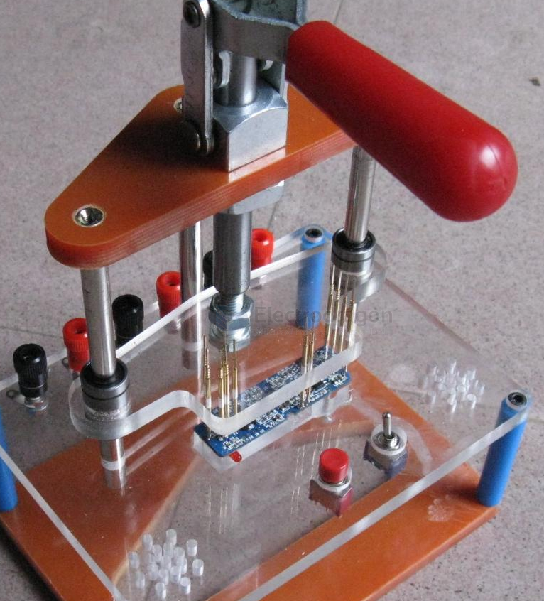

# fab-qc-dat.md

- [[fab-QC-dat]] - [[VI-dat]] - [[AOI-dat]] - [[ICT-dat]] - [[x-ray-dat]] - [[Flying-Probe-dat]] - [[FCT-dat]] - [[Boundary-Scan-dat]] - [[power-up-test-dat]]

- [[PCB-design-dat]] - [[test-point-dat]]

## 虚焊 

- [[fab-QC-dat]] - [[DPR1157-fab]]

## 小批量（你自己现在的场景，几片到几十片）

1. 目检（显微镜） — 免费
2. 限流电源 + 万用表 — 上电前先测 VCC-GND 阻抗，别直接插
3. 功能测试 — 跑一遍应用功能
4. X-Ray 外包 — 有 QFN/BGA 时，抽查 1-2 片验证工艺是否稳定
5. 关键点：先做好第一片，把它当"黄金板"，后面逐片对比

## 量产（几百片以上）

1. AOI（回流后）
2. X-Ray（BGA/QFN 抽检或全检）
3. ICT（有治具、有测试点）
4. FCT（最后一道）
5. 老化/温度循环（可靠性验证，不是常规检测）

## QC issues log 

- [[CONN-USB-micro-vertical-dat]] 

- [[button-dat]]

- [[CONN-USB-type-c-dat]] 

- [[pogo-pin-dat]]

## test rig 

## progress 

- we are push ourselves to get close to [[ISO9001-dat]]

## ref 

- [[fab-qc]]