# fab-stencil-printer-dat 

- [[fab-stencil-dat]] - [[fab-stencil-printer-dat]] - [[fab-stencil-frameless-dat]] - [[fab-stencil-frame-dat]]

- [[fab-PCBA-dat]]

- [[high-precise-printing-dat]]

- [[fab-stencil]]

## Features 

- thickness 0.1 mm 
- "cutting" precision 0.005 mm
- or 0.01 mm
- "machine" bias 0.05 mm

## stencil printer 

## good printer 

1. lock [[PCB-dat]] on X and Y axis 

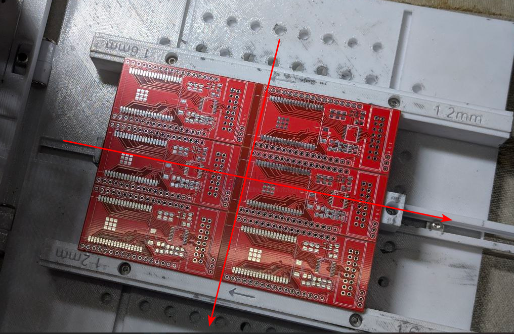

2. stencil should able to lock on both left and right side 

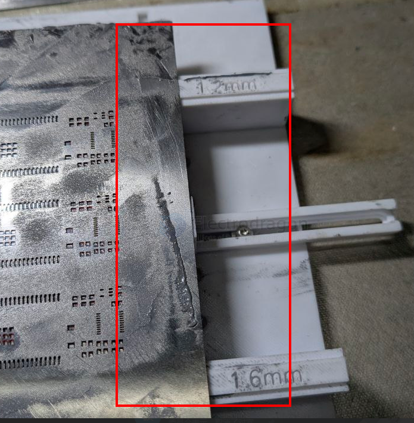

3. no any other moving part except stencil and PCB holder

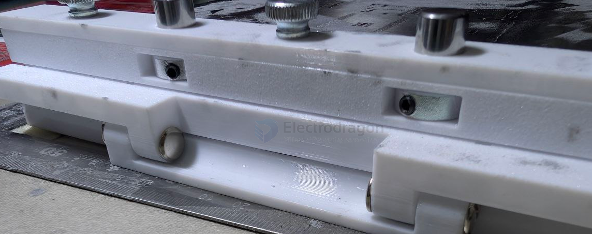

specially the rotating part 

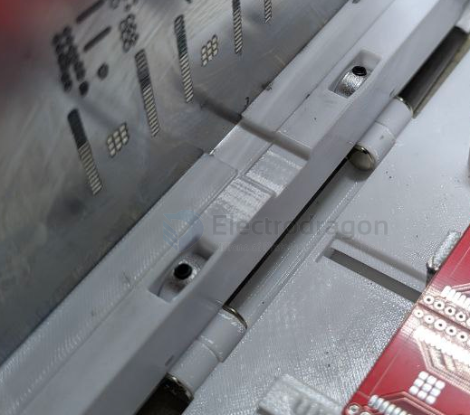

## bad printer  

### tape plus ruler printer 

- loosen 

### table printer 

has gap 

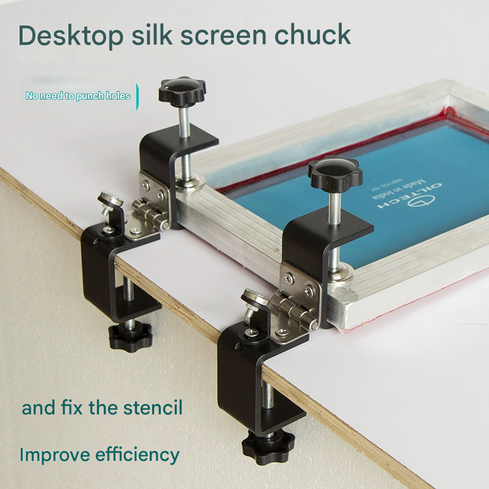

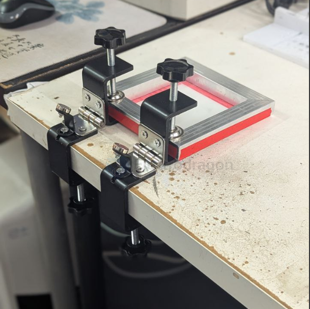

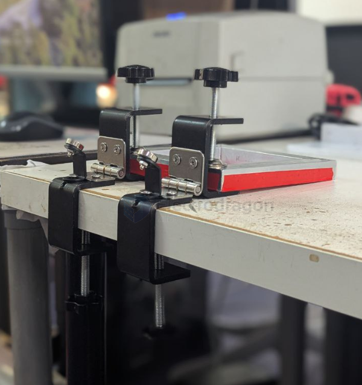

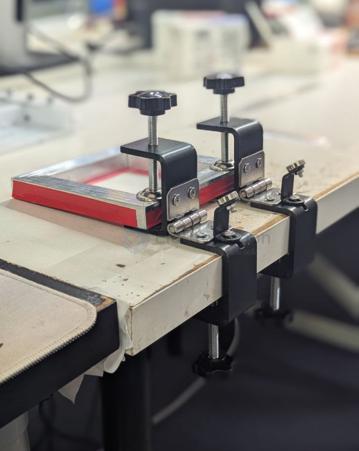

screwed printer 

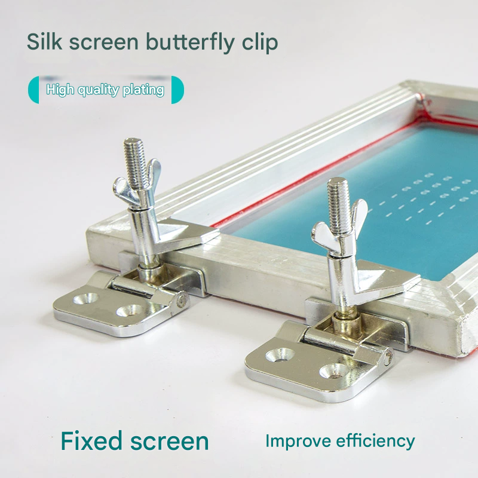

### 3D printed holder 

- hinge has moving space

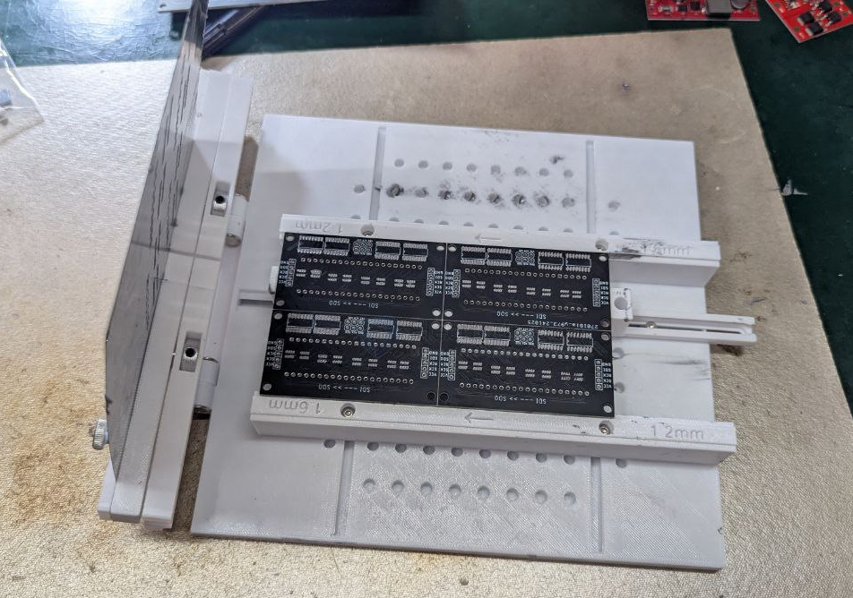

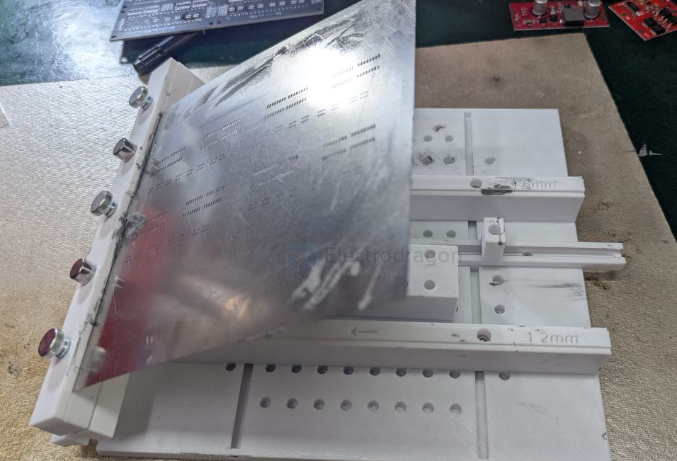

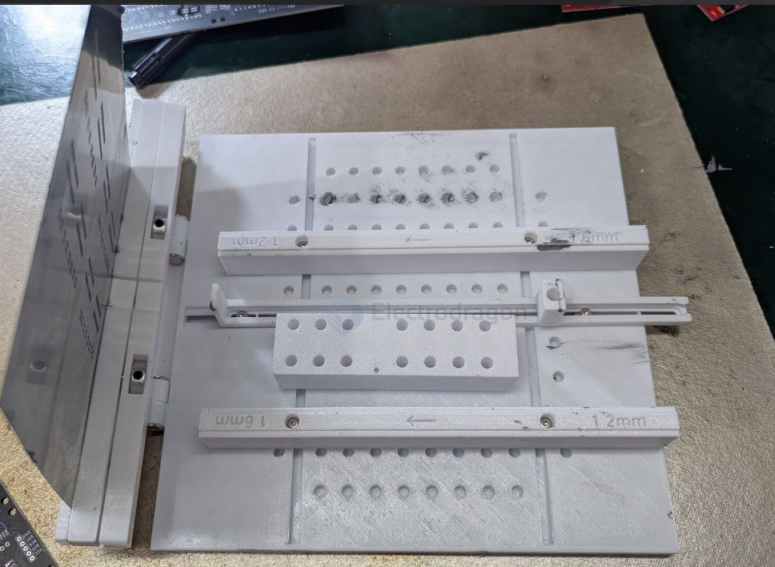

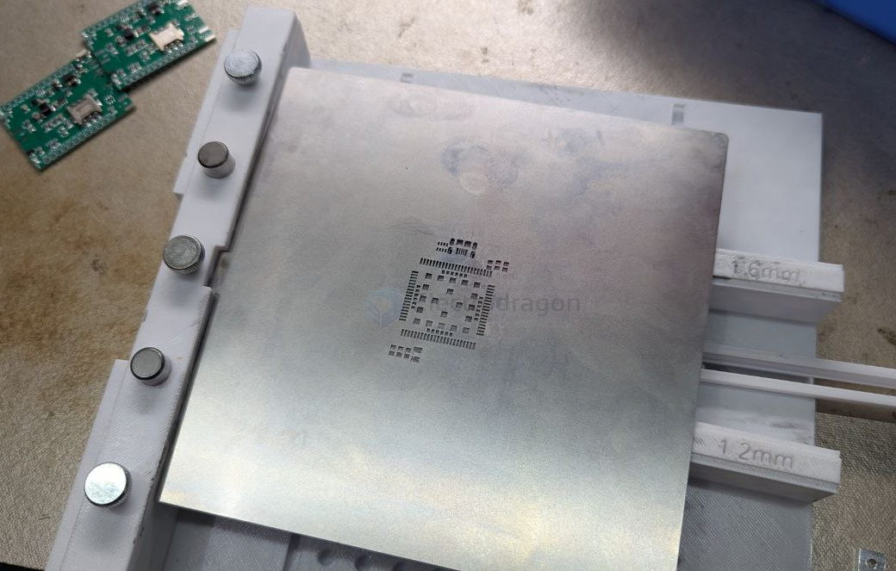

double side printer for - [[NGS1141-dat]]

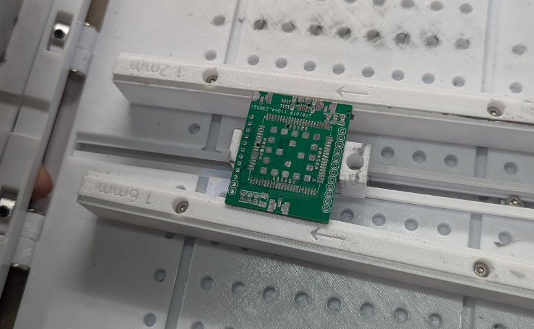

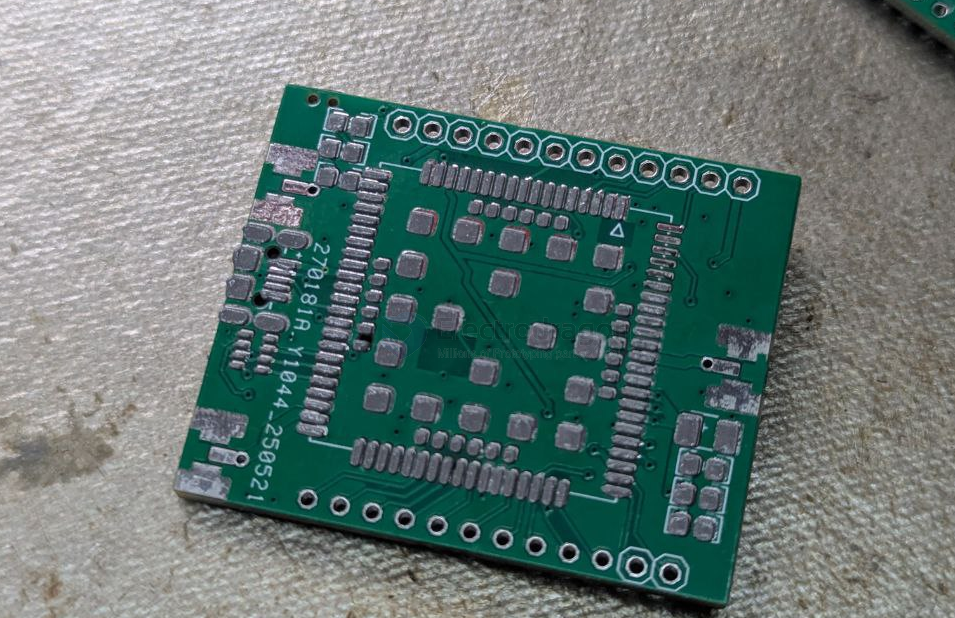

### other ideas 

cruved printer 

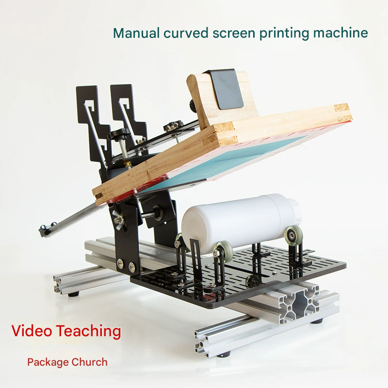

## ref 

- [[fab-stencil]] - [[fab-stencil-print]]