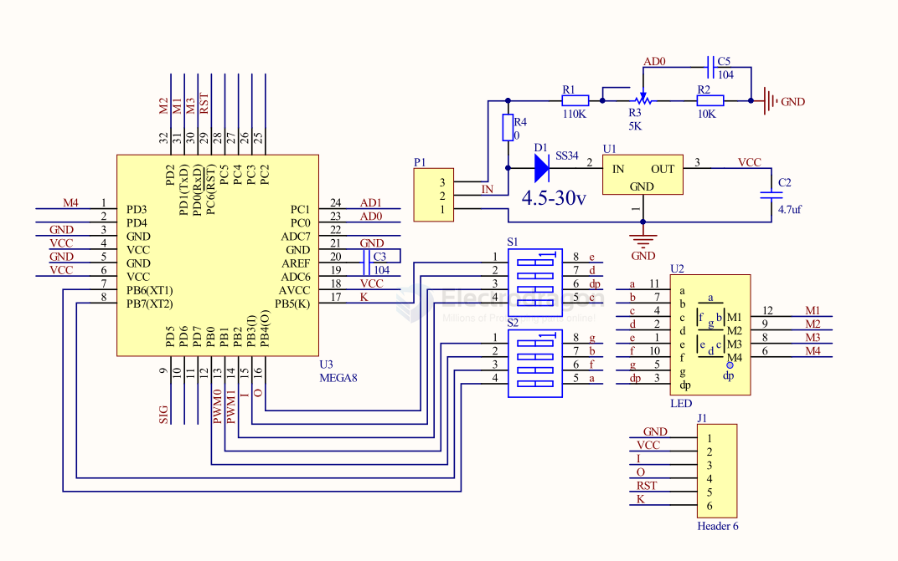

# meter-voltage-dat.md

- [[fab-tools-dat]]

- [[sensor-voltage-dat]] - [[meter-voltage-dat]] - [[SVC1049-dat]] - [[SVC1017-dat]] 

- [[sensor-current-dat]] - [[meter-current-dat]] - [[SVC1022-dat]] - [[SVC1023-dat]] 

## board and apps 

- [[meter-voltage-dat]] - [[SVC1019-dat]] - [[SVC1049-dat]] - [[SVC1017-dat]] - [[SVC1015-dat]]

- [[meter-current-dat]] - [[SVC1022-dat]] - [[SVC1023-dat]] - [[SVC1024-dat]]

- [[meter-resistance-dat]] - [[multimeter-dat]]

## wiring 

## high voltage meter 

- [[high-voltage-dat]]

## simple voltage meter

## ref 

- [[meter-current-dat]] - [[meter-voltage-dat]]