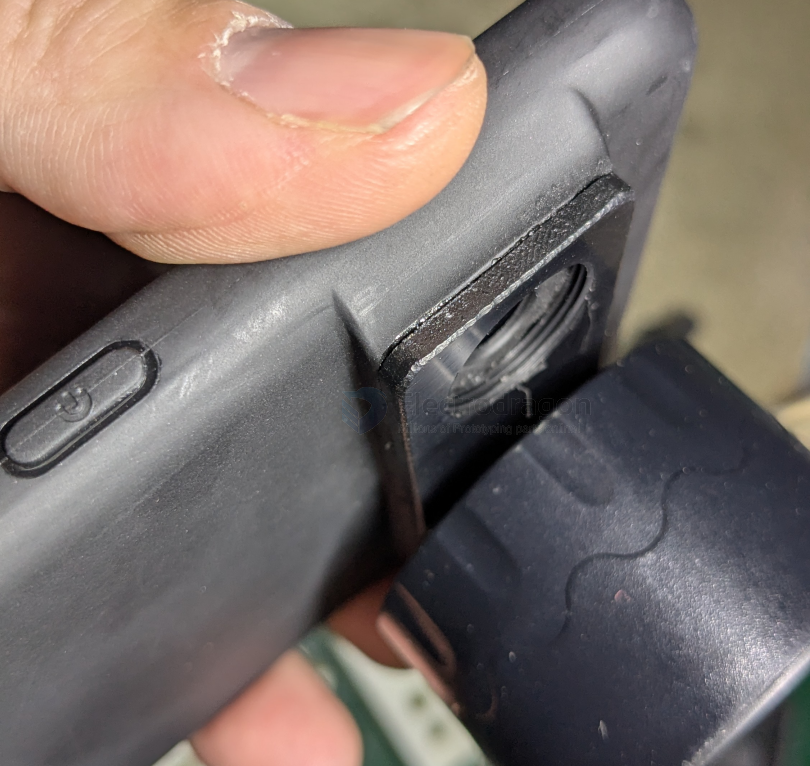

# fab-3d-print-dat.md

- [[3d-print]]

## tech 

- [[Lithophane-dat]]

## features 

- placement

## common 3d printer websites 

- [Printables.com](https://www.printables.com)
- [Thingiverse](https://www.thingiverse.com)
- [MakerWorld](https://makerworld.com)
- [Cults 3D](https://cults3d.com)

- https://thangs.com/?sort=trending

## good projects by 3D print

- [[rover-dat]]

## drone claw

## common errors 

- 存在多壳体结构
- 存在反向三角面
- 存在坏边
- 不存在孔洞缺陷
- 不存在薄壁结构

## example 

### hacking into current products 

extra piece glued to a phone case, as a thread converter 

- [[lens-dat]]

## materials

| Category | Material Name | Tensile Strength (MPa) | Elongation at Break (%) | Flexural Strength (MPa) | Impact Strength (J/m or kJ/m²) | Heat Deflection (HDT °C) | Thermal Expansion (10⁻⁶/K) | Resolution (mm) | Relative Cost |
| :--- | :--- | :---: | :---: | :---: | :---: | :---: | :---: | :---: | :---: |
| **Metal** | **TC4 (Titanium)** | 900-1100 | 10-15 | 1100+ | Very High | >800 | 8.6 | ±0.1-0.2 | $$$$$ |
| | **316L / BJ-316L** | 500-550 | 30-45 | 600-800 | Very High | >600 | 16.0 | ±0.1-0.2 | $$$$ |
| **Nylon** | **PA12 / PA12S** | 45-50 | 15-22 | 60-70 | 30-50 J/m | 175 | 80-110 | ±0.3 | $$ |
| (SLS/MJF)| **1172Pro / PA11** | 45-48 | 35-45 | 45-55 | Very High | 160-180 | 90-120 | ±0.3 | $$$ |
| | **3401GB (Glass Bead)** | 45-55 | 5-8 | 75-90 | 25-35 J/m | 170-180 | 60-80 | ±0.3 | $$ |
| | **3301PA / 3201PA-F** | 44-50 | 20-35 | 55-65 | 35-50 J/m | 150-175 | 80-110 | ±0.3 | $$ |
| | **PAC** | 40-45 | 15-25 | 50-60 | Medium | 150+ | 90-110 | ±0.3 | $$ |
| **Eng. Plastic**| **PPA-CF (Carbon)** | 100-140 | 2-4 | 180-220 | 10-15 kJ/m² | 220-230 | 20-30 | ±0.2-0.3 | $$$ |
| (FDM) | **PA12-CF** | 75-90 | 3-5 | 130-150 | 12-18 kJ/m² | 150-170 | 40-60 | ±0.2-0.3 | $$$ |
| | **PC / PC-ABS** | 50-70 | 10-50 | 80-100 | 20-50 kJ/m² | 110-140 | 60-80 | ±0.2-0.3 | $$ |
| | **ABS / ASA** | 35-45 | 10-25 | 60-75 | 15-30 kJ/m² | 90-95 | 80-100 | ±0.2-0.3 | $ |
| | **PLA / PLA Color** | 50-65 | 3-6 | 80-100 | 15-20 J/m | 55-60 | 80-100 | ±0.2 | $ |
| | **TPU / PEBA** | 20-35 | 300-600 | N/A | No Break | 50-80 | 100+ | ±0.3 | $$ |
| **Resin** | **JLC Temp (High)** | 55-65 | 2-5 | 90-110 | 15-25 J/m | 120-200 | 70-90 | ±0.1 | $$ |
| (SLA) | **9000HE / X Resin** | 42-50 | 15-25 | 55-65 | 45-60 J/m | 52 | 90-100 | ±0.1 | $ |
| | **8228 / 8001 / CBY** | 40-45 | 10-20 | 65-75 | 30-45 J/m | 55 | 95-110 | ±0.1 | $ |
| | **LEDO 6060 / 9600** | 40-45 | 5-12 | 65-75 | 20-30 J/m | 56 | 95-110 | ±0.1 | $ |
| | **JLC Black / Grey** | 38-45 | 8-15 | 55-70 | 25-35 J/m | 50-55 | 100+ | ±0.1 | $ |
| | **Imagine Black** | 35-42 | 10-15 | 55-65 | 30-40 J/m | 52 | 100+ | ±0.1 | $ |
| | **JLC Full Color** | 30-40 | 5-10 | 45-55 | Low | 45-50 | 110+ | ±0.1 | $$ |

树脂

- LEDO 6060
- 9600
- JLC Black
- Black
- CBY
- Imagine Black
- 8001
- 8228
- Grey
- JLC Temp
- JLC全彩树脂
- 9000HE
- X树脂

尼龙

- PA12
- 3301PA
- 3201PA-F
- 1172Pro
- PA11
- PA12S
- 3401GB
- PAC

metal 

- BJ-316L
- 316L
- 钛合金TC4

engineering plastic 

- ABS
- PLA
- ASA
- PA12-CF
- PC-ABS
- TPU
- PC
- PPA-CF
- PLA彩色
- PEBA

PA12 

成型工艺: MJF多射流熔融
材料精度: ±0.3mm或0.4%以内
颜色: 黑/灰黑色
热变形温度: 175℃
断裂伸长率: 15%
拉伸强度（MPa）: 48
弯曲强度（MPa）: 70
冲击强度: 3.5（kJ/m​²）

优点： 机械性能相对更强

缺点： 灰黑色存在色差、表面有轻微颗粒感、无法打印完全封闭的空心结构

3301PA

成型工艺: SLS选择性激光烧结
材料精度: ±0.3MM或0.4%以内
颜色: 白色
热变形温度: 179.1℃
断裂伸长率: 30%
拉伸强度（MPa）: 48
弯曲强度（MPa）: 45
冲击强度: 5（J/m​）

优点： 颜色白，耐温性好，强度高，出色的韧性和抗冲击性。

缺点： 表面存在颗粒感，无法打印空心结构。

LEDO 6060

成型工艺: SLA立体光固化
材料精度: ±0.2mm或0.3%以内
颜色: 白泛黄
热变形温度: 56℃
断裂伸长率: 10%
拉伸强度（MPa）: 50
冲击强度: 45（J/m​）

优点： 尺寸稳定性高、优异的耐黄变性、低收缩、适合做批量件

缺点： 耐温一般、不适宜放置高温及强太阳光环境。

9600

成型工艺: SLA立体光固化
材料精度: ±0.2mm或0.3%以内
颜色: 哑光白
热变形温度: 59°C
断裂伸长率: 5.50%
拉伸强度（MPa）: 55
弯曲强度（MPa）: 81
冲击强度: 32（J/m​）

优点： 价格便宜、颜色更白（哑光白），耐用性较好，机械性能好。

缺点： 韧性一般、高温及强太阳光环境下使用易变形/发黄

## ref 

- [[3d-print]]