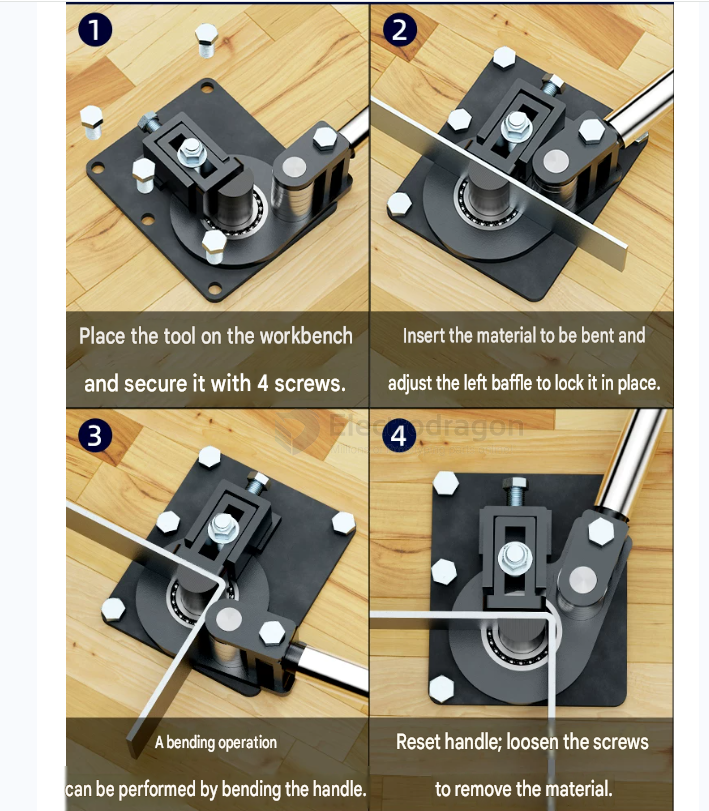
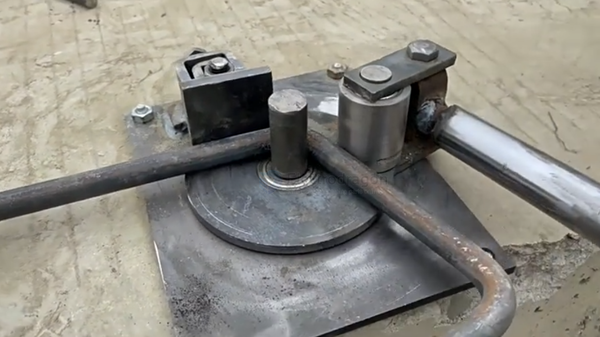
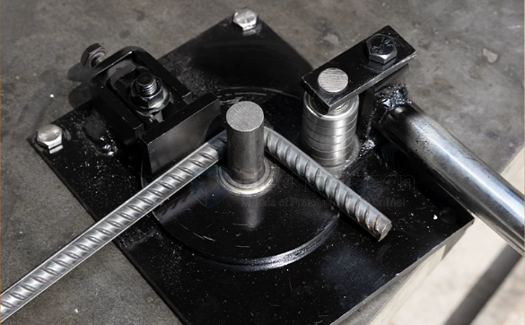

# fab-bending-dat

- [[fab-bending-dat]] for [[flat-bar-dat]] - [[tube-dat]] - [[rod-dat]] - [[fab-sheet-metal-dat]] 

- [[tube-bend-dat]]

## tools 

小号铁把手 可弯2X40mm

小号不锈钢把手 可弯3X40mm

双区扁铁小号 可弯3X40mm

大号铁把手 可弯4X50mm

大号不锈钢把手 可弯5X50mm

双区扁铁大号 可弯5X50mm

## ref 

- [[fab-product]] - [[fab-bending]]
