# fab-sheet-metal-dat

- [[fab-sheet-metal-annotation-dat]]

- [[rivet-dat]] - [[rivet-nut-dat]]

- [[metal-dat]] - [[tube-dat]]

## common to use sheet metal products 

- Aluminum can | 易拉罐 | 0.08–0.12 mm | 深拉伸成型，极薄 |

3️⃣ 铝制路牌 / 广告牌边角料 == 厚度：0.5–1.0 mm

- 加工：
  - 手钻
  - 台钳折弯
  - 拉铆钉

✅ 非常适合：  
- 小型钣金件  
- 结构件  
- 可反复使用  

4️⃣ 电脑机箱侧板（Steel / SECC）
- 厚度：0.6–0.8 mm
- 来源：旧电脑
- 特点：
  - 真·钣金材料
  - 可点焊 / 铆接
- 适合：
  - 支架
  - 底板
  - 承力结构

⚠ 比铝硬，加工略费力

## CAD sheet metal 

start - thicken 

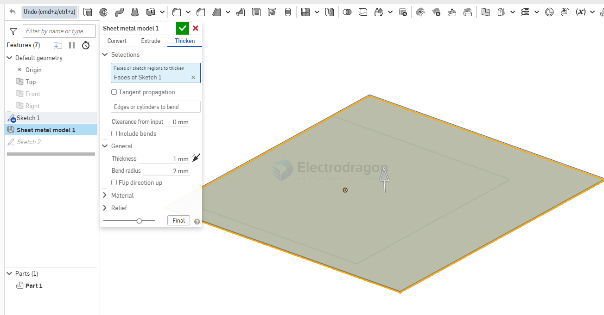

flange 

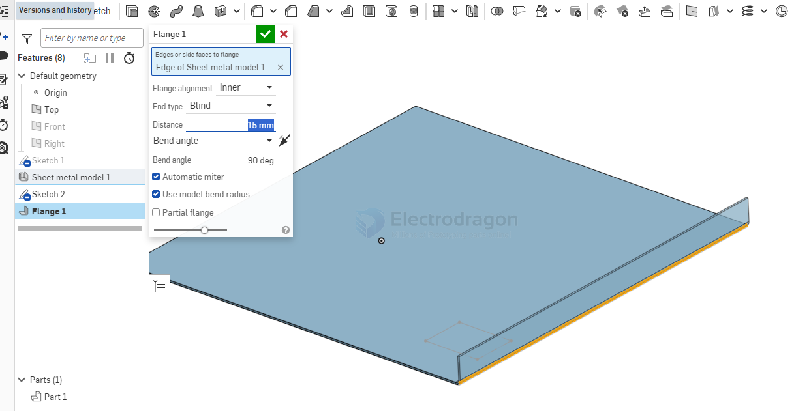

flange hold line 

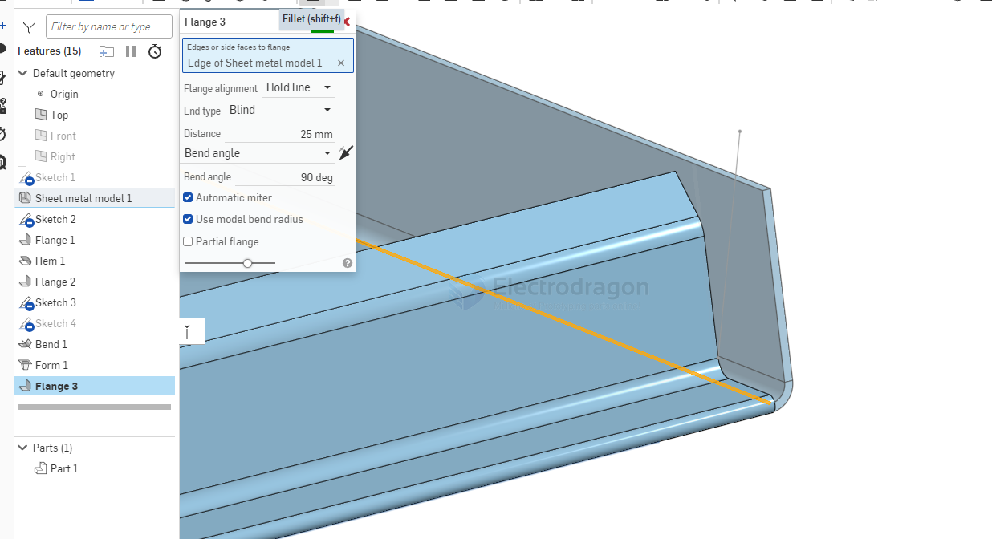

- [[fab-sheet-metal-hem-dat]]

tab 

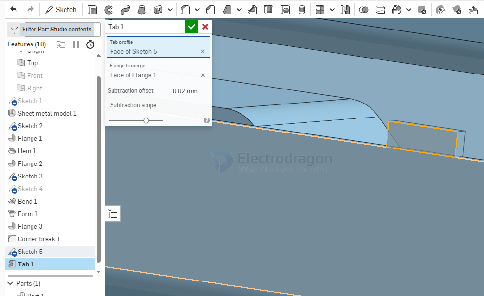

tab and slot 

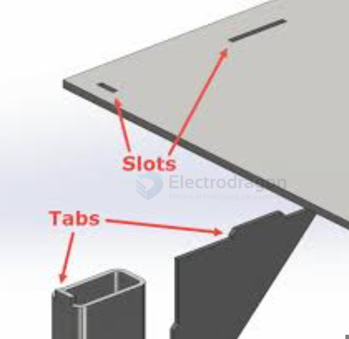

bend 

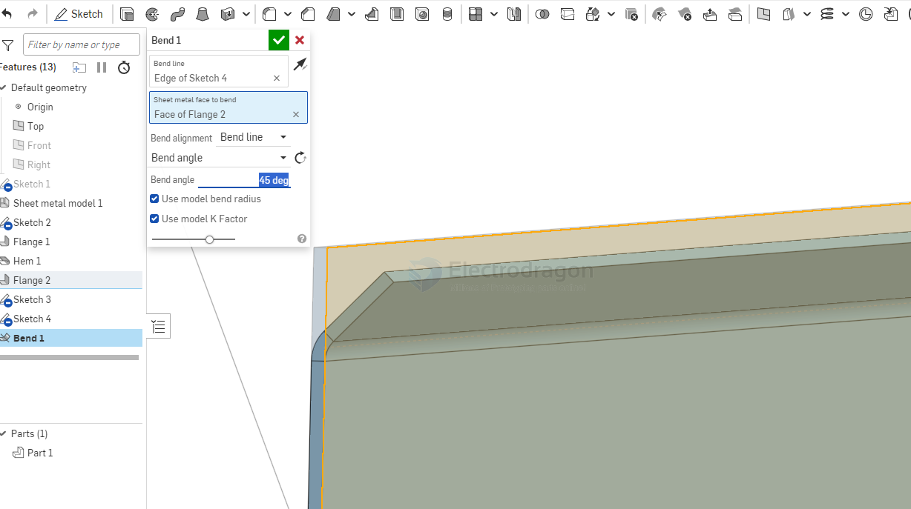

form 

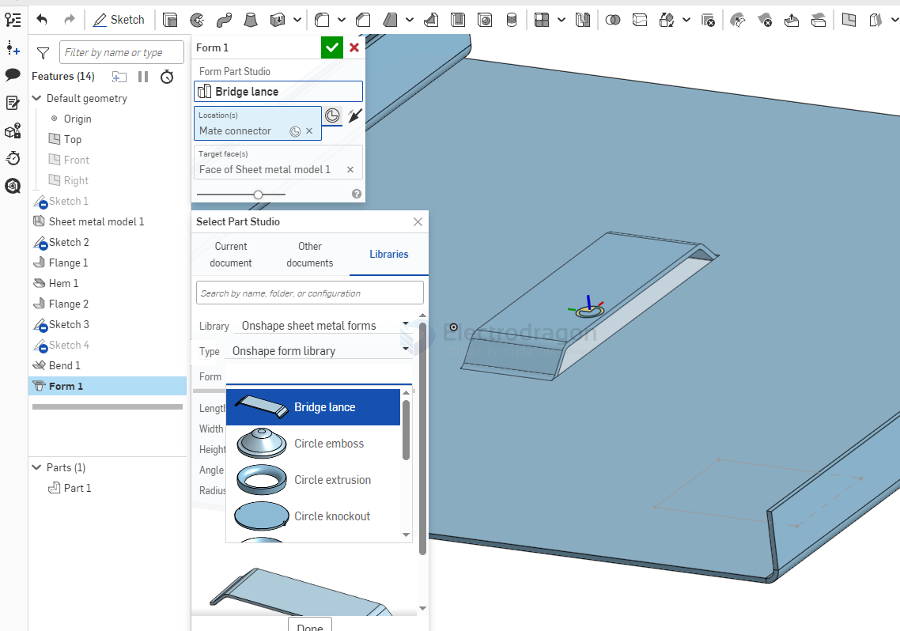

make joint 

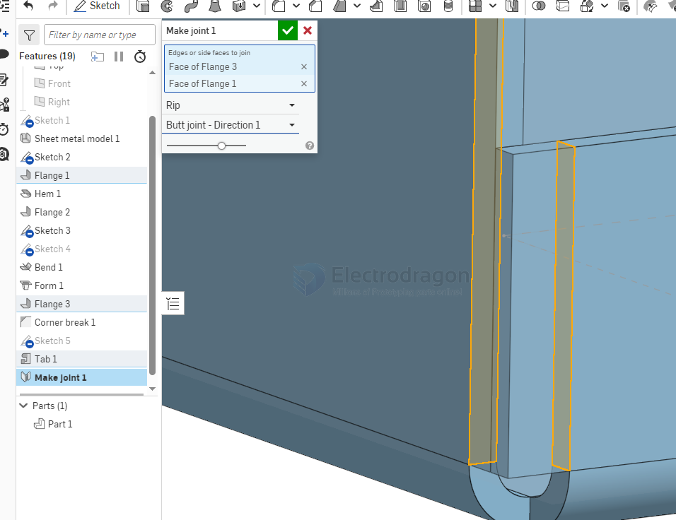

corner 

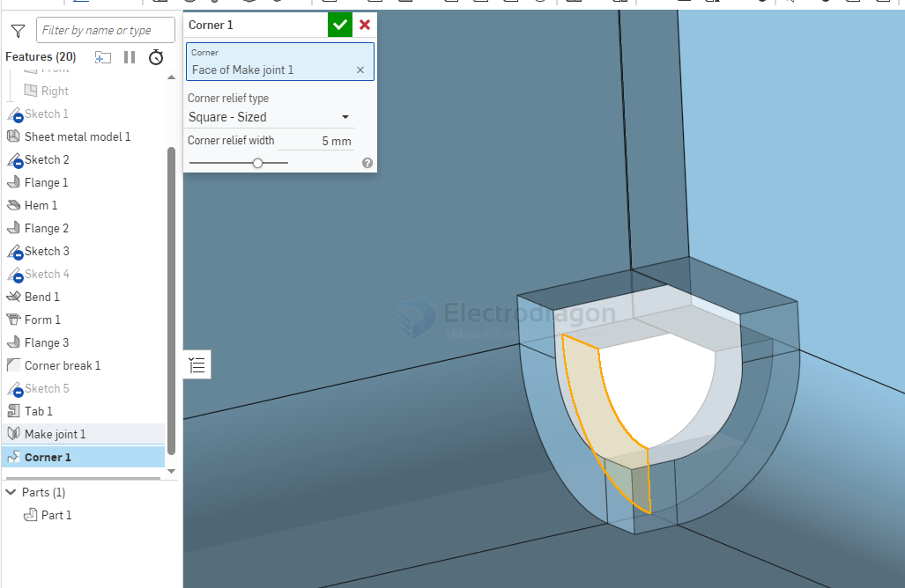

bend relief

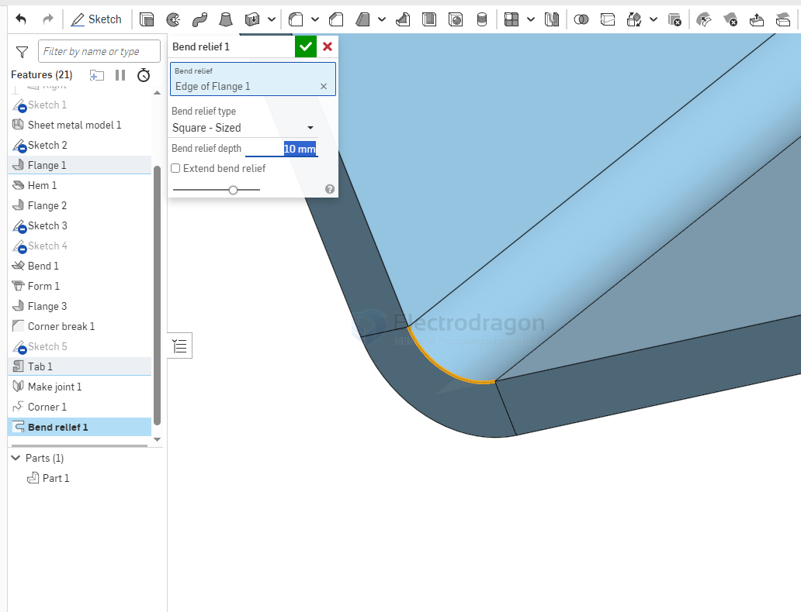

corner break 

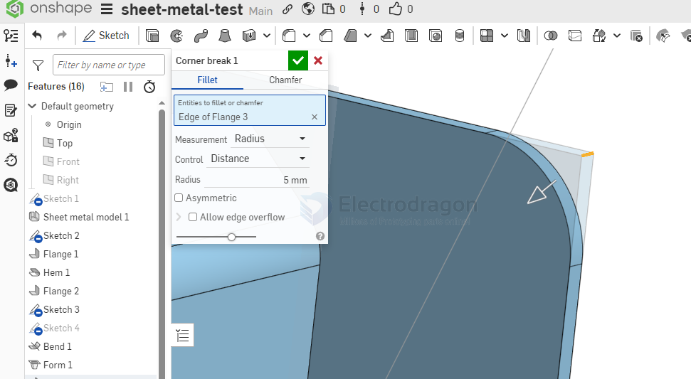

- Supported 3D (required) formats: .step, .stp; Supported 2D formats: dwg, dxf, pdf; Compressed packages (zip, rar) can be uploaded directly.
- Supports unified ordering for multiple parts in a compressed package; file names for 2D files, BOM lists, etc., need to be consistent (number of files per upload 20, individual file size <100M).
- If there are assembly relationships between parts, it is strongly recommended that you upload an assembly STEP file.

Sheet Metal Fabrication typically refers to cold working processes on metal sheets, mainly including the following major categories ??

## 1. Cutting / Blanking

Cut the sheet to size for blanks

- Shearing
- Laser cutting
- CNC punching / Turret punch
- Plasma cutting
- Waterjet cutting
- Saw cutting

## 2. Stamping / Punching

Forming locally or entirely through molds

- Punching
- Blanking
- Trimming
- Flanging / Extrusion
- Deep drawing
- Embossing / Beading
- Forming stamping

## 3. Bending / Forming

Change the angle or shape of the sheet

- Press brake bending
- Air bending / Bottoming / Coining
- Roll bending
- Hemming
- Curling

## 4. Forming

Change the overall or local shape of the sheet

- Deep drawing
- Hydroforming
- Flanging
- Necking / Expanding

## 5. Joining

Combine multiple sheet metal parts

- Spot welding
- TIG / MIG welding
- Riveting
- Blind rivet
- Screw fastening
- PEM fasteners
- Clinching

## 6. Surface Treatment

Improve appearance, corrosion resistance, or functionality

- Powder coating
- Painting
- Plating
- Anodizing (aluminum)
- Brushing
- Polishing
- Black oxide
- Passivation

## 7. Finishing

Improve dimensional and assembly quality

- Deburring
- Chamfering
- Leveling
- Tapping
- Reaming / Countersinking

## 8. Common Materials (Sheet Metal)

- Cold rolled steel (SPCC)
- Galvanized sheet (GI / SECC)
- Stainless steel (304 / 316)
- Aluminum sheet (5052 / 6061)
- Copper / Brass

## 9. One-sentence Summary

Sheet Metal Fabrication = Cutting  Stamping  Bending  Forming  Joining  Surface Treatment  Finishing

## Examples Stainless Steel 201

- The following bending rack price == 20RM == 3 USD

## Example Plastic PP PE Sheet

unit == mm, color == black

## ref

- [[CAD-dat]] - [[AI]]

- [[fab-sheet-metal]] - [[fab]]