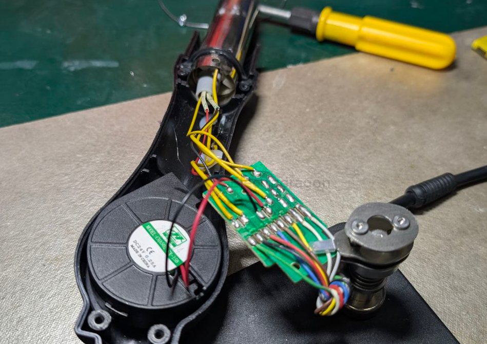

# hot-air-station-dat

## common defective error 

- temperature sensor read wrong 

## hot air handle 

- [[high-voltage-warn-dat]] 

yellow wires 220VAC 

3V and 5V DC also on board for [[fan-dat]], etc

wires 

✅ In a hot-air handle with only heater + temperature sensor, no fan and no reed switch

The internal parts are:

Heating element (ceramic heater) → always 2 wires

Temperature sensor → usually 2 wires

Protective ground wire → 1 wire

This adds up to 5 wires, matching your description.

## ref 

- [[hot-air-station]]

- [[soldering-tools-dat]] - [[fab-workspace-dat]]