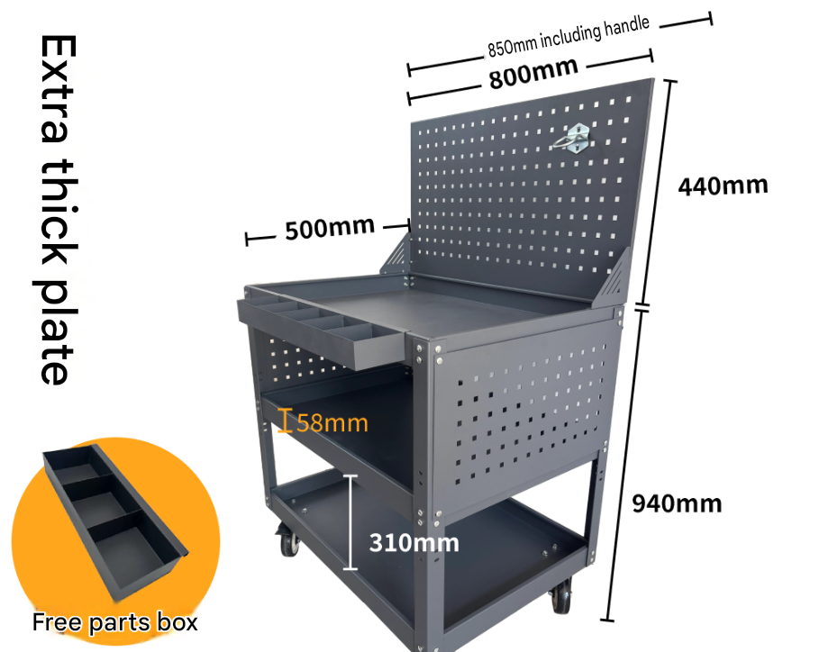

# fab-workspace-dat

- [[fab-tools-dat]] - [[fab-workspace-dat]] - [[fab-PCB-soldering-tools-dat]]

## soldering 

- [[fab-PCB-dat]] - [[fab-PCB-soldering-dat]] - [[fab-soldering-tools-dat]] - [[fab-PCB-desoldering-dat]] - [[fab-soldering-materials-dat]]

## instruments 

- [[multimeter-dat]] - [[UNI-Trend-dat]] == [[UT118B-dat]] - [[PTOS035-dat]]

- [[power-dat]] - [[CONN-DC-barrel-jack-dat]]

- [[microscope-dat]]

- [[logic-analyzer-dat]]

## cables 

- [[cable-dat]] - [[conn-dat]] 

- [[CONN-Banana-plug-dat]] - [[CONN-Alligator-clip-dat]] - [[PCG1012-dat]] - [[CONN-dat]]

## disassembly

- [[fab-tools-dat]]

- [[adhesive-dat]] - [[adhesive-remover-dat]] == [[glue-dat]]

- [[adhesive-remover]]

## testing 

- [[pogo-pin-dat]]

## storage 

- [[case-dat]] 

- [[fab-tools-dat]] - [[fab-materials-dat]] holder 

## ref 

- [[fab-workspace]] - [[fab-PCB-soldering-tools]]