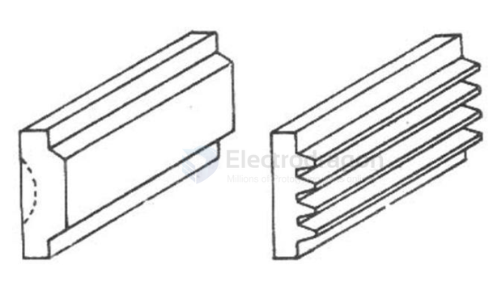
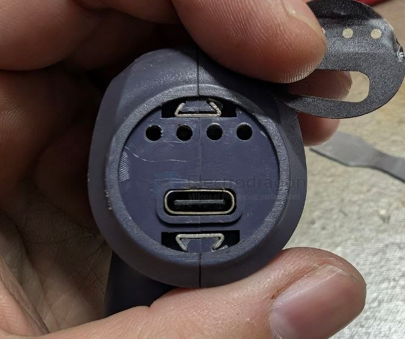
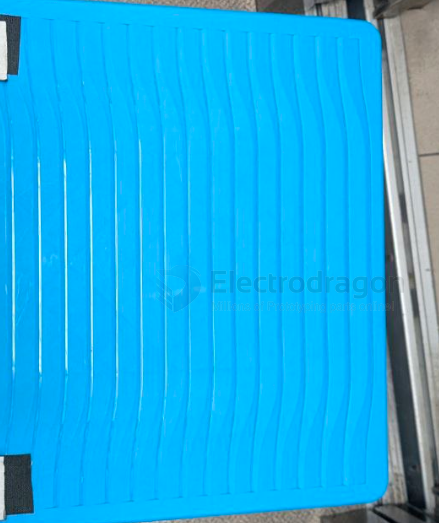
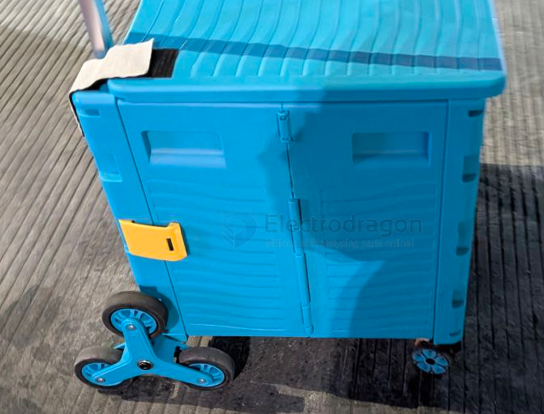

# plastic-structure-dat

- [[plastic-dat]] - [[plastic-structure-dat]]

（3）为了增加产品的刚度，应增加加强筋的数目而不是高度，加强筋应设计的矮一些，多一些为好，如图所示。

## apps 

- [[electric-sprayer-dat]] - [[plastic-dat]] - [[plastic-structure-dat]]

## plastic half locker 

## enforcement 

surface 

fold 

## ref 

- [[plastic-dat]] - [[onshape-dat]]