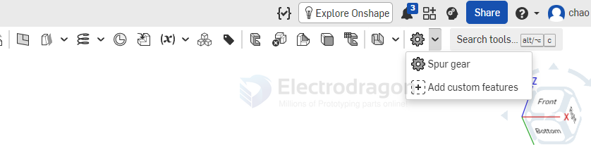

# onshape-dat

- [[onshape-dat]] - [[CAD-dat]] - [[mechanical-structure-dat]]

- [[onshape-constrain-dat]] 

## Direct Editing Tools (Modifying Imported STEP Geometry)

If you import a part that already has a fillet or feature you want to remove, use these tools inside a **Part Studio**.

### 1. Delete Face (Best for removing fillets)
* **What it does:** Removes selected faces and automatically heals the surrounding geometry.
* **How to use it:** 
  1. Open the **Delete Face** tool from the toolbar.
  2. Select all tangent faces making up the fillet radius.
  3. Ensure the dropdown option is set to **Heal**.
  4. Click the checkmark. Onshape will extend the adjacent flat faces until they intersect, leaving a sharp corner.

### 2. Replace Face
* **What it does:** Swaps a complex or curved face with a flat or defined target face.
* **How to use it:**
  1. Open **Replace Face**.
  2. Select the fillet or geometry you want to get rid of as the *Face to replace*.
  3. Select an adjacent flat face as the *Replacement face*. Onshape will extend that flat plane to cover the old feature.

## Assembly-to-Part Workflow (Uniting & Editing Components)

Because Onshape features like **Boolean** and **Delete Face** only work inside a **Part Studio**, you must bring your assembly components into a Part Studio environment to fuse them.

### Step 1: Create an In-Context Part Studio
1. Open your **Assembly** tab.
2. In the top-right toolbar, click **Create Part Studio in-context** (Part Studio icon with an assembly arrow).
3. Select the origin or a face to set the starting point, then click the checkmark. 
4. This opens a new Part Studio where your assembly appears as a translucent "ghost" reference.

### Step 2: Convert "Ghosts" to Solid Bodies
1. Click the **Transform** tool (`Shift + T`).
2. **Crucial:** Change the top dropdown menu from *Translate by line* to **Copy in place**. *(Failing to do this will cause an error asking for vertices/edges).*
3. Click on the assembly ghost parts you want to copy.
4. Click the checkmark. They are now actual, editable solid parts sitting perfectly in position.

### Step 3: Fuse into a United Part
1. Click the **Boolean** tool (`Shift + B`).
2. Set the operation type to **Union**.
3. Select your newly created solid parts.
4. Click the checkmark. 

**Result:** You now have a single, unified part that you can immediately edit using the Direct Editing tools from Part 1!

## custom features 

- [[thread-dat]]

## relevant 

- [[ALU-extrusion-dat]] - [[Alu_Extrusion-dat]]

## commands 

    shift + enter
    Accept & repeat command
    enter
    Accept command
    escape
    Cancel
    space
    Clear selection
    ctrl/cmd
    c
    Copy
    shift
    c
    Curve/surface analysis
    delete
    /
    backspace
    Delete selection
    shift
    d
    Dihedral analysis
    ctrl/cmd
    shift
    f
    FeatureScript search
    ctrl
    u
    Feedback/Report a bug
    a
    Flip primary axis
    k
    Hide/show mate connectors
    shift
    /
    Keyboard shortcuts
    shift
    Lock mate inference
    ctrl
    m
    Mate connector
    [
    Measure
    ctrl/cmd
    click
    Open in new tab
    shift
    click
    Open in new window
    ctrl/cmd
    v
    Paste
    ctrl
    space
    Quick tab switching
    ctrl
    y
    /
    shift
    cmd
    z
    Redo
    shift
    n
    Rename selection
    q
    Reorient secondary axis
    alt/⌥
    c
    Search tools
    `
    Select other
    s
    Shortcut toolbars
    alt/⌥
    t
    Tab manager
    ctrl/cmd
    z
    Undo

## ref 

- [[cad-dat]]