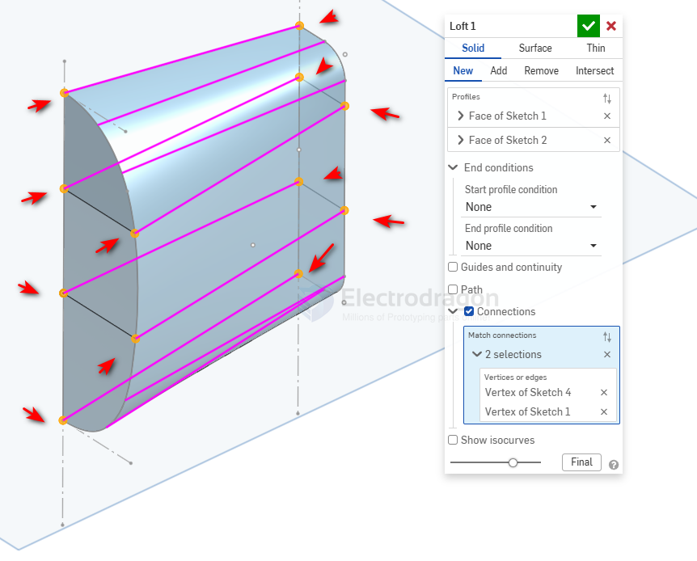

# part-loft-dat

When a Loft tool in Onshape twists or rotates between two cross-sections, it is usually because the default **vertex matching is misaligned** (the start points or vertices aren't lined up correctly). This happens frequently when designing aircraft bodies if the node counts or orientations of your sketches don't match.

Fix and maintain consistency in your lofts with three effective methods:

### 1. Use Guide Curves (Most Recommended for Aircraft Modeling)
For smooth, organic aircraft fuselages, relying solely on two cross-sections is rarely enough; you need guide curves to constrain and "straighten" the surface.
* **How to do it:** In a side or top sketch, draw 3D curves or sketch curves connecting key points between your front and rear sections (such as the top, bottom, and widest left/right points).
* **Application in Loft:** After selecting your two profiles in the Loft dialog, click the **Guides** input box, then select these connecting curves in order. This completely eliminates twisting and precisely controls the longitudinal curvature of the fuselage.

### 2. Use "Connections" to Manually Align Vertices

If you prefer not to draw additional guide curves, you can manually specify corresponding points to correct the twist.
* **How to do it:** 
  1. Open the Loft dialog, select your two profiles, and expand the **Connections** section at the bottom.
  2. Onshape will display pink default connector lines (if it's twisted, these lines will cross each other).
  3. Click the **Connections** selection box, then manually click a **vertex on the first profile**, followed by the **corresponding target vertex on the second profile** (e.g., the top-most vertex of both sketches).
  4. Repeat this to establish multiple correspondence pairs, which will straighten out the distortion.

### 3. Standardize Sketch Structure (Equal Vertices and Alignment)

Onshape's loft algorithm relies heavily on the **number of vertices and the initial alignment** of both ends.
* **Symmetry and Alignment:** Make sure the center axes (origins) of both sketches point in the same relative direction. Lofting between a simple circle and a complex rectangular frame often leads to misaligned blending.
* **Split Entities:** If you are lofting shapes with different complexities, use the **Split** tool to break your smoother sketches into matching segments so they share an equivalent number of nodes. This prevents the software from guessing vertex connections and rotating incorrectly.