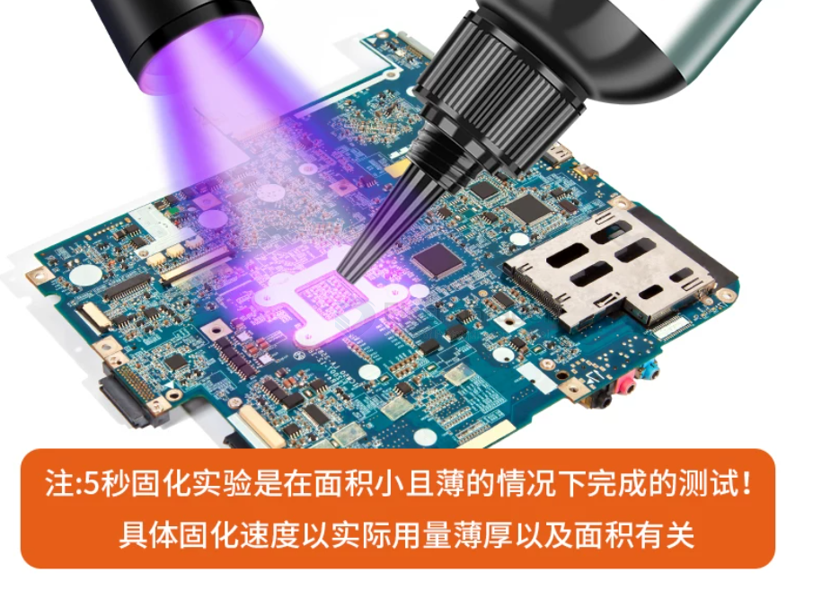
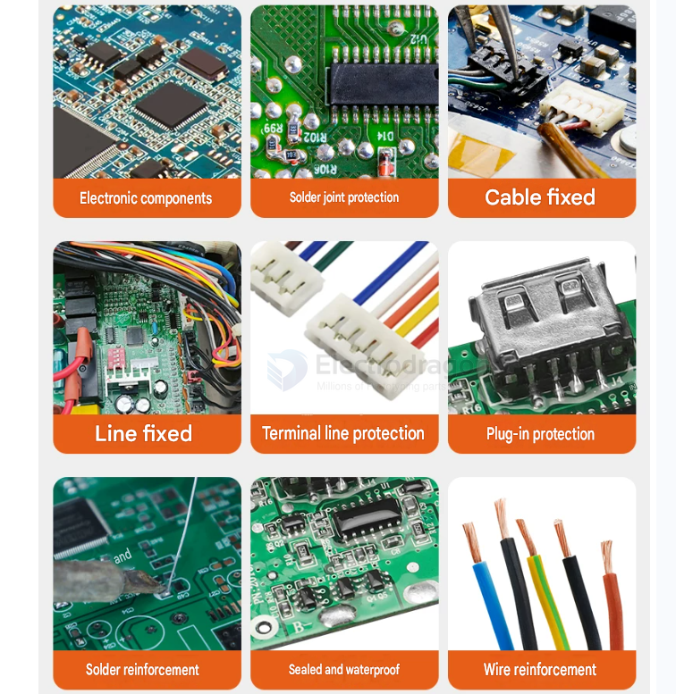
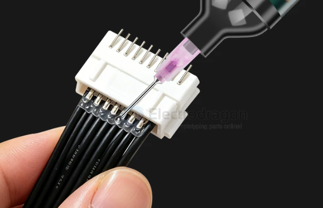

# glue-UV-dat

- [[glue-hot-dat]] - [[glue-UV-dat]] - [[glue-dat]] - [[cable-dat]] - [[installation-dat]]

## Compared to hot melt adhesive

Compared to hot melt adhesive, **light-curing adhesive (commonly referred to as UV glue)** offers decisive advantages in terms of **precision, strength, and operational control**. 

Here is a breakdown of why light-curing adhesive outperforms hot melt glue in many scenarios:

---

### 1. Key Advantages

*   **Total Control: No Light, No Curing**
    *   **Hot Melt Glue**: Once extruded from the glue gun, it cools and solidifies within seconds. You have to act extremely fast, and there is almost no room for micro-adjustments if things go misaligned.
    *   **UV Glue**: It remains in a liquid state indefinitely until exposed to ultraviolet (UV) light. You can take your time to perfectly position the parts and wipe away any excess glue. Once everything is flawless, a few seconds under a UV light will instantly cure it.
*   **Micron-Level Precision**
    *   **Hot Melt Glue**: The adhesive is thick and leaves a bulky, rubbery layer after curing.
    *   **UV Glue**: It has excellent fluidity, allowing it to penetrate micro-gaps. The cured layer can be as thin as a few microns, making it essential for precision electronics, lenses, or delicate figure repairs.
*   **Invisible Aesthetics & No Stringing**
    *   **Hot Melt Glue**: It is notorious for "stringing" (creating messy spiderweb-like threads) and cures into an opaque or semi-transparent blob, which can look messy.
    *   **UV Glue**: It cures to a crystal-clear finish, achieving virtually seamless bonding. It is perfect for glass, acrylic, and other transparent materials.
*   **Superior Temperature Resistance & Strength**
    *   **Hot Melt Glue**: It relies on physical curing (melting via heat, solidifying via cooling). This means it is **not heat-resistant**. If exposed to high temperatures (e.g., inside a car on a hot summer day or near a hot microchip), it will soften or melt again.
    *   **UV Glue**: It triggers a photochemical reaction that creates strong chemical cross-links. Once cured, it boasts exceptional bond strength and high temperature resistance—it will not re-melt.

---

### 2. Side-by-Side Comparison

| Feature | Light-Curing Adhesive (UV Glue) | Hot Melt Glue |
| :--- | :--- | :--- |
| **Curing Mechanism** | UV Light Chemical Reaction | Physical Cooling & Solidification |
| **Adjustment Time** | Unlimited (until UV light is applied) | Very Short (seconds to tens of seconds) |
| **Layer Thickness** | Ultra-thin, high precision | Thick, better for gap filling |
| **Appearance** | Highly transparent, no trace, no stringing | Semi-transparent/White, prone to stringing |
| **Thermal Resistance** | Excellent (won't degrade under heat) | Poor (re-melts easily when heated) |
| **Bond Strength** | High (structural grade bonding) | Moderate (easy to peel off) |
| **Material Limit** | At least one side must be transparent | Works on most materials (opaque is fine) |

---

> **⚠️ The Main Limitation:**
> UV glue **must be exposed to UV light** to cure. If you are bonding two completely opaque metal blocks together where the light cannot penetrate, the glue inside will remain liquid. In such cases, hot melt glue or epoxy (AB glue) would be more suitable.

## info 

fix in least down to 5 seconds 

Electronic components generate heat during use, but UV electronic adhesive is unaffected by heat-induced deterioration, maintaining stable sealing and fixing performance even at 120°C.

- +120°C
- -40°C

Specifically designed for electronic components.

Excellent adhesion, suitable for solder joint protection, ribbon cable fixing, precision electronic bonding, and other bonding needs. Prevents exposed circuitry.

Prevents direct exposure of components and circuitry, improving the waterproof and moisture-proof performance of components.

Impact resistance. Enhances the integrity of electronic components, improving their resistance to external impacts and vibrations.

## app 

## ref 

