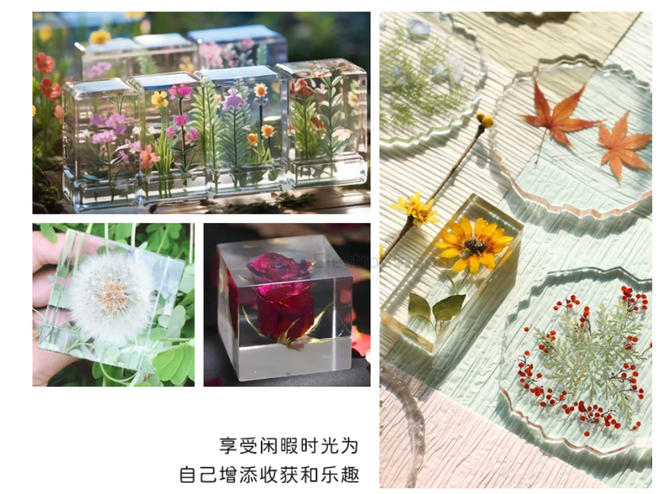

# epoxy-glue-dat.md

## apps 

- 昆虫标本 

- 防水

## info 

AB胶通常是环氧树脂胶，分为树脂（Resin）和固化剂（Hardener）两部分。

epoxy glue is commonly referred to as AB glue.

三、推荐的具体胶水（常见好买）
✅ 性价比方案（可 DIY）

慢固化 AB 胶（24 小时型）

比如：工业级环氧胶、EPOXY ADHESIVE

强度明显高于 5 分钟胶

⭐ 更稳的工程方案

3M DP420 / DP460（环氧结构胶）

Loctite EA 9460 / 9480

Loctite 330（配底涂）（丙烯酸）

## ref 