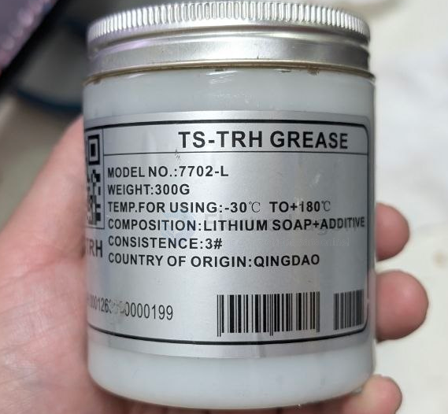

# grease-dat

- [[grease-dat]] - [[fab-mechanics-dat]]

这是一罐 锂基润滑脂（Lithium Soap Grease），用于机械部件的润滑。

规格解读：
- 型号：7702-L
- 重量：300g
- 使用温度：-30°C ~ +180°C（宽温，户外设备适用）
- 成分：锂基皂 + 添加剂（锂基脂，通用性最好的润滑脂）
- 稠度：3#（较硬，NLGI 3 级）

典型用途：
- 轴承、齿轮、导轨润滑
- 电机轴承、传动机构
- 户外机械（温度范围宽，适合）

结合你的项目（贴片机、遥控船、FPV），可能是给贴片机导轨/丝杠或遥控设备的传动件用的。需要我记录到哪个项目里，或者你想了解它适不适合某种特定用途？

## ref 

