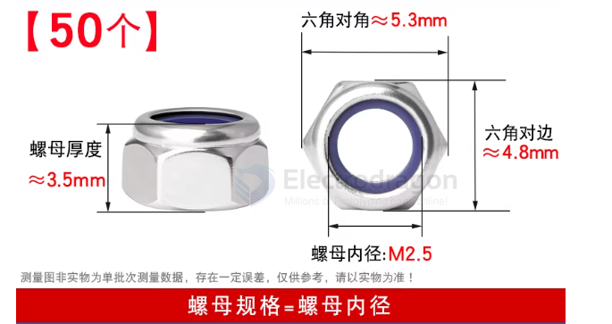
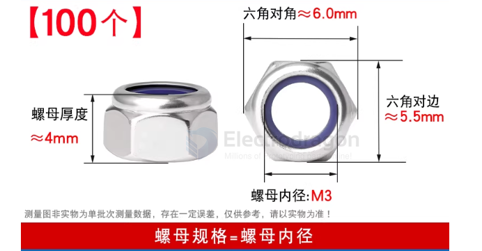
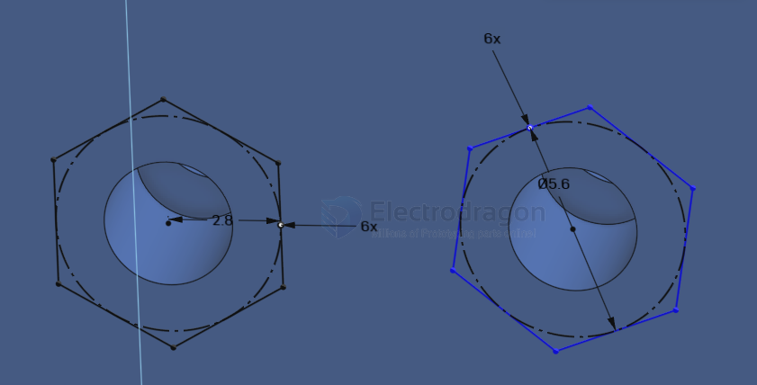

# Nut-dat

- [[nut-t-dat]] - [[nut-thumb-dat]] - [[nut-dat]] - [[CAD-dat]]

- 螺母

M2.5 perpendicular 5.5 

M3 perpendicular 6 

create nut placeholder

M4 perpendicular 8 

## ref 

- [[nut]] - [[screws]]