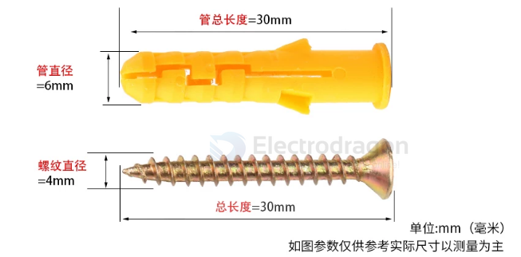

# bolt-expansion-dat

- [[bolt-expansion-dat]] - [[bolt-dat]] - [[mechanical-parts-dat]] - [[screw-dat]] - [[thread-dat]] - [[nut-dat]] - [[washer-dat]]

## 1. Metric Sizes (Most Common Globally)
In the metric system, the "M" number indicates the outer diameter of the bolt thread in millimeters. 

| Size    | Drill Bit Diameter | Common Lengths | What It's Used For                                                                                     |
| :------ | :----------------- | :------------- | :----------------------------------------------------------------------------------------------------- |
| **M6**  | 10 mm              | 50mm – 80mm    | **Light duty:** Hanging kitchen cabinets, bathroom fixtures, mirror frames, lightweight wall shelving. |
| **M8**  | 12 mm              | 60mm – 100mm   | **Medium duty:** TV wall mounts, air conditioner outdoor brackets, water heaters, railings.            |
| **M10** | 14 mm              | 70mm – 120mm   | **Heavy duty:** Garage racks, heavy doors, swing sets, awnings, pull-up bars.                          |
| **M12** | 16 mm              | 80mm – 150mm   | **Extra heavy duty:** Structural anchoring, steel beam brackets, heavy machinery installation.         |

> **Crucial Rule for Metric:** The drill bit size you need to drill into the concrete is **larger** than the bolt size because it needs to fit the entire outer expansion sleeve. For example, an M6 bolt usually requires a 10mm masonry drill bit.

6 x 30 ~ 50 ~ 100 

## wall amount plan 

- use 8x M6 
- use 6x M8
- use 4x M10
- use 4x M12

## ref 

